# byteworker 架构总览

> 本文件是 byteworker 的**系统流程与代码边界约束**，面向人类维护者和 coding agent。
> 它回答两个问题：信息怎样从外部来源进入知识库并再次被查询；代码模块应该怎样协作而不失控。
>
> - 行为入口与 Agent 工作流以 [`SKILL.md`](SKILL.md) 为准。
> - 持久化 schema、目录和数据不变量以 [`DESIGN.md`](DESIGN.md) 为准。
> - 系统流程、模块职责和依赖方向以本文件为准。
> - 代码与测试是“当前真实实现”的验证。若它们与本文件不一致，必须在同一变更中修正代码或文档，
>   不得带着已知漂移继续开发。

## 0. 一眼看懂

byteworker 不是传统后端服务，也没有数据库。它由 Agent、确定性 Python 工具和独立的本地
Markdown 知识库共同组成：

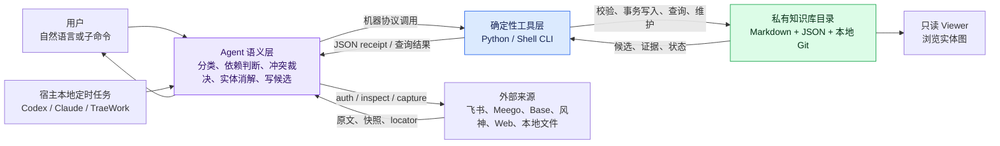

核心分工：

| 层 | 负责 | 不负责 |
|---|---|---|
| Agent 语义层 | 理解内容、按唯一 policy 产出带 reason/evidence 的语义决定、生成完整候选、解释结果 | 不手算 hash，不自行发明冲突/晋升阈值，不绕过事务直接写 KB |
| Python / Shell 工具层 | 授权检查、抓取、规范化、hash、幂等、schema 校验、原子写入、回滚、查询、修复 | 不理解业务语义，不决定“这是什么项目/决策” |
| 私有知识库 | 保存原文、出处、知识节点、用户状态、报告和本地回滚历史 | 不进入本 skill 仓库，不配置 remote |

## 1. 系统边界

### 1.1 三个物理区域

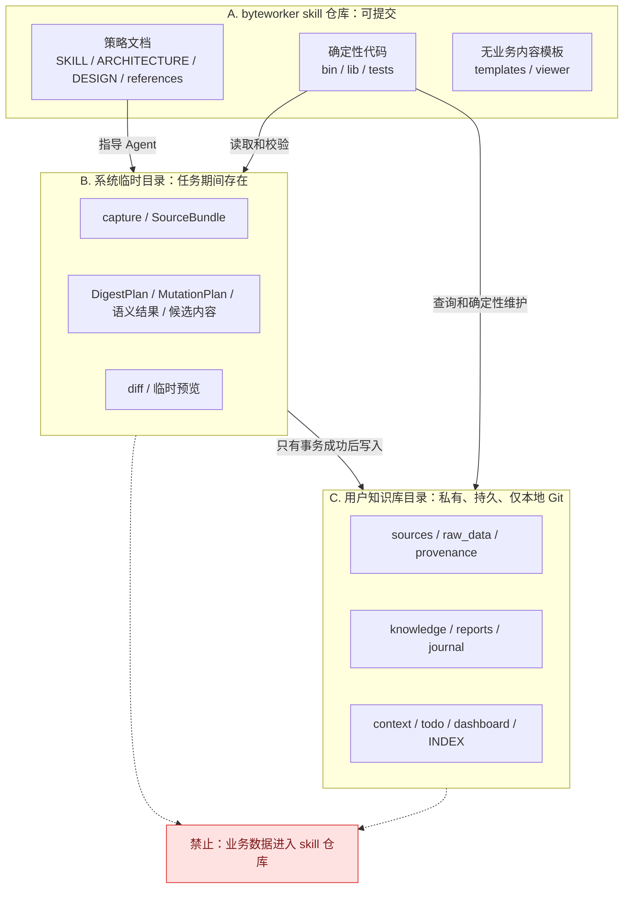

硬边界：

- skill 仓库只保存通用逻辑、文档、测试和无业务内容模板。
- capture、bundle、plan、候选节点可能含机密，必须放系统临时目录或知识库目录。
- 知识库目录是独立本地 Git 仓库，禁止配置 remote，禁止 push。
- 外部凭据只能来自环境变量、宿主授权存储或仓库外权限受限文件，不得进入任何 bundle、raw、
  provenance、日志或命令参数。

### 1.2 文档职责

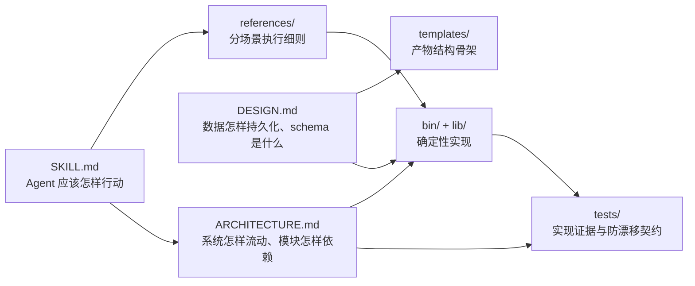

## 2. 整个 skill 的信息处理流程

### 2.1 每次调用的公共前置流程

每个新 session 第一次调用 Byteworker 时共享同一个确定性准备阶段。Agent 只调用一个入口；
健康路径没有输出，也不需要理解内部检查分支：

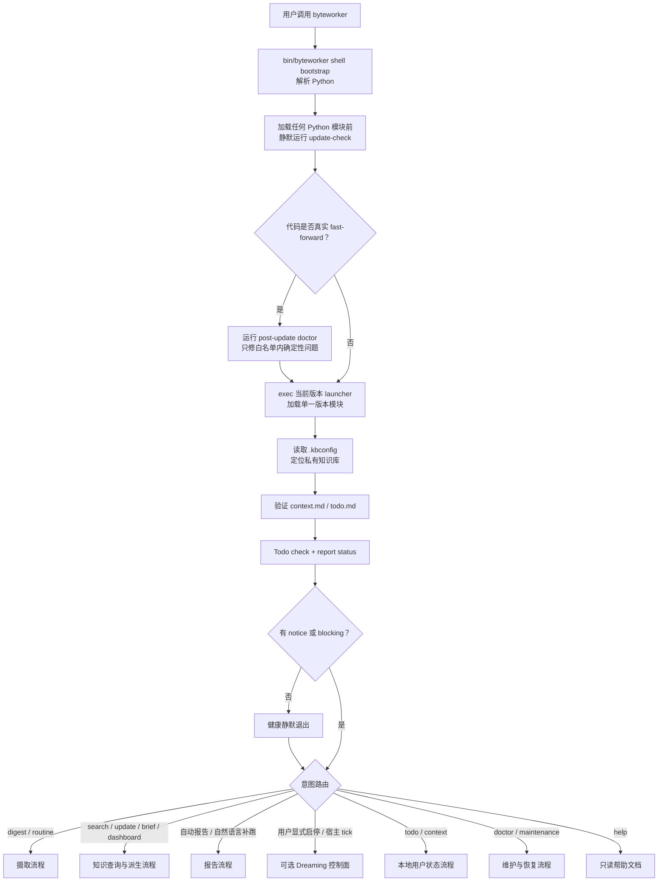

`bin/byteworker` 是不会预加载仓库 Python 模块的稳定 shell bootstrap。它将首次解析成功的
Python 绝对路径持久化为本机缓存；缓存没有 TTL，每次只做
最小可执行与版本检查，路径被删除、失去执行权限或解释器不再兼容时才重新扫描。库层同样持久化
已解析的核心命令与来源 runtime，不因时间、PATH 或虚拟环境变化主动刷新；显式 override、
`deps --refresh`、`runtime-reset` 仍可要求重建。`lib/runtime_deps.py` 从显式 override、当前
PATH、常见本地目录和 NVM installations 中解析可执行文件，实际执行仍由 `bin/byteworker`
注入同一组环境。preflight 的更新检查在 shell 中先完成，之后 `exec` 当前工作树的 launcher，
因此不会在一次调用中混用更新前后模块。`lib/session_preflight.py` 只合并 KB 定位、依赖、Todo
和自动报告设置检查，并接收 shell 传入的有限更新 notice。它不读取 `context.md` 正文：
语义任务在路由后通过 `context view --intent` 读取固定章节投影，help/纯维护任务不承担这部分
context。
公共阶段的目的不是“加载所有数据”，而是以稳定协议建立安全边界。

Dreaming 不属于公共 preflight。状态缺失等同关闭；普通 session、安装、升级和
digest/search/update 等既有入口不读取 Dreaming 状态，也不提示启用。

### 2.2 单来源 digest 主流程

单来源的新标准是 `SourceBundle v2 + DigestPlan v2`：

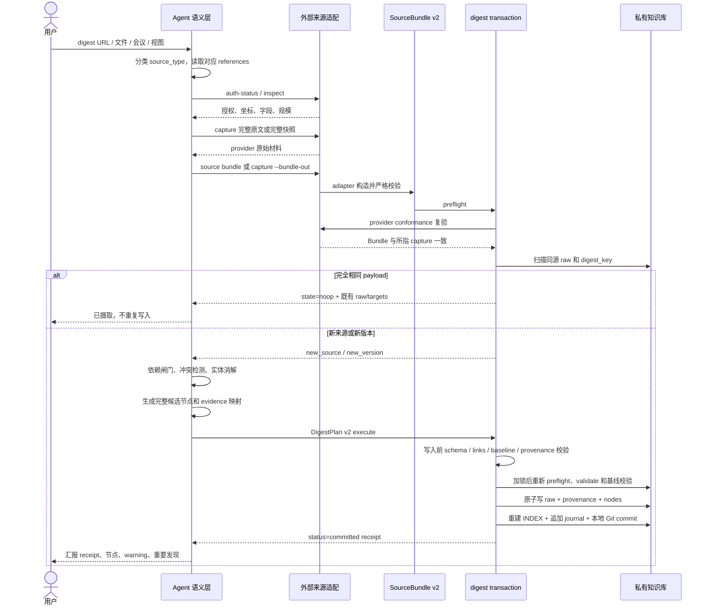

其中只有 Agent 做语义判断；事务层只接受完整、显式的结果：

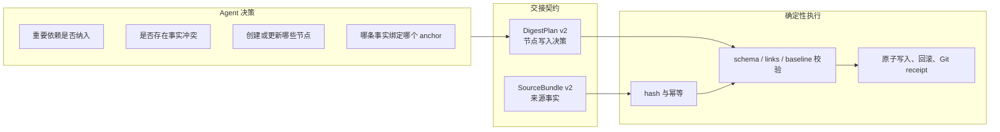

### 2.3 结构化来源的更新流程

Meego、Base、风神等大视图不把每一行变成知识节点：

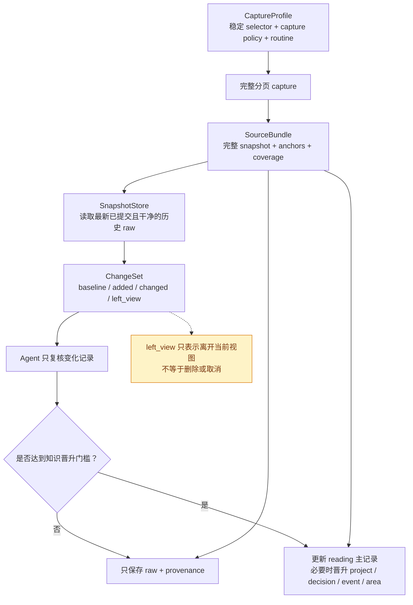

Meego 空间主页不是可持久化来源。operation adapter 只执行 `url decode` 判断 URL 类型，确认
`project_home / project_overview` 后立即以 `SOURCE_SELECTION_REQUIRED` fail closed，提示用户
提供包含 `/storyView/<view_id>` 的具体 Story View URL。该路径不触发 Auth Guard，不调用
`project search / view search / view get`，也不使用页面自动化。收到明确保存视图后，流程才进入
上图的 Profile / capture / Bundle。

### 2.4 查询与引用流程

查询不是让 Agent 盲扫整个知识库，而是先确定性召回，再回到原始证据：

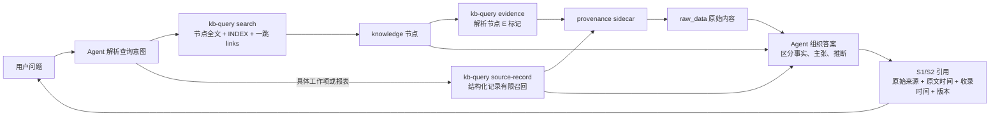

`record_index` 存在时，`source-record` 优先读取 provider-neutral 的
`byteworker-record-index/v1`；旧 raw 才通过兼容投影解析 Meego/Base/Aeolus 原始结构。

### 2.5 自动报告、Todo 与维护流程

```mermaid
flowchart TB
    subgraph Reports["自动日报 / 周报"]
        H1["宿主本地定时任务<br/>或自然语言补跑"]
        R0["获取跨日报 / 周报单租约"]
        R1["确定时间范围"]
        R2["完整运行全部启用的<br/>routine digest"]
        R3["查询 nodes / raw / journal"]
        R4["生成带出处候选<br/>KB mutation 原子写入"]
        R5["记录成功 / 失败并释放租约"]
        H1 --> R0 --> R1 --> R2 --> R3 --> R4 --> R5
    end

    subgraph State["用户状态"]
        S1["自然语言 Todo / Context 请求"]
        S2["Agent 解析意图和时间"]
        S3["todo.py 或 KB mutation"]
        S1 --> S2 --> S3
    end

    subgraph Maintenance["诊断与恢复"]
        M1["doctor scan"]
        M2["扫描 Profile / routine 覆盖<br/>raw 绑定与持久化契约"]
        M3{"确定性 auto_fix？"}
        M4["重建 INDEX / 修复明确 links"]
        M5["报告 schema / provenance / graph<br/>Profile 迁移问题"]
        M1 --> M2 --> M3
        M3 -->|"是"| M4
        M3 -->|"否"| M5
    end
```

自动日报和周报的调度归宿主管理，byteworker 不另起常驻服务，也不把系统 cron 当兼容兜底。
任务必须在知识库目录、宿主 `local` 环境中运行；云端 routine 和隔离 worktree 无法可靠访问或
写回私有知识库。两类自动报告每次都完整运行已登记且启用来源的 routine digest，不使用
`.last-routine-digest` 的七天交互提醒阈值跳过。`report_automation` 记录
`last_attempt/last_run/last_success` 并确定性判断指定 period 是否缺口；单租约只防止同一知识库
重叠运行。周期性补偿仍由第三个宿主原生任务唤醒，应用服务不承担任务唤醒、不常驻、不使用
系统 cron。

Dreaming 是新增的可选旁路控制面，默认关闭。用户明确确认额外网络/模型/存储开销以及机器需
保持开机、唤醒、联网前，还必须先完成独立能力导览，讲清它与 digest 的差异、全部 job、授权、
Finding/Action 生命周期、维护和退出边界，并配置确认完整运行计划。三项确认都记录后，宿主 local task 才可调用
`dreaming run-due`。初始实现不接管上述自动报告；`daily/weekly` job 默认关闭。后续迁移必须先
释放旧 scheduler owner，并由 `migration_epoch` 保证同一 period 只有一个 owner。

配置入口属于 Agent 交互层，不新增另一套状态或配置 writer。自然语言中的“自动分析、定时摘要、
紧急提醒、调整频率/范围、继续设置”路由到 `references/dreaming-setup-guide.md`；Agent 先读取
公开 `dreaming status`，使用宿主结构化选项逐步收集选择，按依赖复验后再调用既有
`configure/grant/enable/harness` facade。用户界面只展示“后台信息助手、自动检查、待关注事项、
定时摘要、紧急提醒、本地定时任务”等产品语言；内部字段和原始 status JSON 只用于确定性映射和
显式排障，不能成为用户理解或完成配置的前置条件。

宿主差异只存在 Agent/harness 兼容层，不进入 scheduler。TRAE 产品家族环境按
`references/dreaming-harness-trae.md` 先识别具体产品：TRAE IDE/TraeCode（包括内置 SOLO）
没有 Dreaming 所需的本地定时任务入口，只提示用户切换到 TraeWork 桌面版；TraeWork 桌面版
才可在“自动化”中创建本地 Code 任务，按用户确认的唤醒间隔执行 runner 并首次触发。产品未确认或没有
Schedule 工具回执时保持 `harness.status=pending`，不能猜私有 API、改应用配置或用
cron/launchd 冒充 Agent task。TraeWork 网页版的云端任务不能访问本地 KB 和用户态 lark-cli，
不是等价 fallback。

```text
宿主 local tick
  → dreaming run-due
  → process / morning / maintenance / recovery（初始启用）
  → daily / weekly（显式迁移后）
  → dreaming complete
```

Dreaming 只通过 `bin/byteworker` 公开入口调用 source、query、mutation 或 DigestTxn，不 import
这些模块的内部实现。Dreaming 禁用、状态损坏或 job 失败均不得改变 digest/search/update 等
既有命令和未迁移的旧自动报告行为。

I7 后独立 Inbox 不再是 workflow：旧 scanner、writer、模板、context intent 和 route manifest
条目均已删除。`bin/inbox.py` 只是一个 major 版本的无副作用 tombstone，只输出
`INBOX_REMOVED`，不得读取 IM、Dreaming state 或 KB。明确的单次 IM 分析进入 Dreaming
foreground `process once`，持续处理进入显式 IM grant。新 KB 不创建 `reports/im/`；历史目录
由 doctor 只读识别，`kb_mutation` 显式拒绝该路径；任何升级、扫描或 Dreaming 流程都不得改写
或删除其内容。

`maintenance` 同样只调用公开 `doctor scan/fix` facade。doctor 仍是修复白名单和 KB 写事务的
唯一 owner；Dreaming 不复制 finding 分类或 repair 实现。该 job 只把 error、证据/身份风险和
自动化阻断等有限元数据交给用户决策，使用 `DOCTOR_USER_DECISION_REQUIRED` 停在
`waiting_for_user`，避免重复提醒；其失败不阻塞其它 job。

### 2.6 Agent 文档路由与语义收敛

`SKILL.md` 只承担意图路由和全局不变量。`references/workflow-routes.json` 是机器可检查的
workflow 闭包：每个入口声明 `required/on_error`，digest 再按 `source_type/features` 条件加载。
子 Agent、无人值守报告和 Wiki resume 都必须从 manifest 递归展开闭包，不依赖上一 session
或主 Agent 的隐式记忆。

大型输入采用单一语义 owner：主 Agent 只做抓取、规模/依赖确认与 receipt 收尾；worker 必须用
`fork_turns="none"` 启动，只接收自足 prompt 和系统临时 artifact 路径。worker 从 SourceBundle
生成一次临时 semantic work packet，正文、评论与白板结构 JSON 各只进入一次，后续仅按 anchor
定点回读。主 Agent 不同时读取 component、生成候选或轮询临时文件；worker 只在有限阶段或需要
用户裁决时回报，最终返回紧凑 receipt 摘要。该约束避免主/子双重语义分析和历史对话重放。

search/update/brief/dashboard/context 分别使用独立 reference；公共机器协议只定义 envelope 和
成功判定，工具参数从对应 workflow 或 `--help` 发现。CI 对 reference-only 闭包设置字符预算，
防止 progressive disclosure 被重新聚合文件破坏。

`context.md` 仍是真相源，但 `lib/context_view.py` 按 intent 返回固定章节投影，并设置 12k
软预算、24k 硬预算；mutation 另限制完整 context 不超过 32 KiB。语义决定使用唯一 policy：
冲突动作由 `conflict-policy.md` 定义，知识晋升/参与方推断/IM 评分由 `semantic-policy.md`
定义。IM 结果必须先通过 `lib/semantic_policy.py` 校验分数、阈值、reason code 和消息证据，
再允许写报告或触发 digest。

## 3. 数据生命周期

### 3.1 真相源与派生物

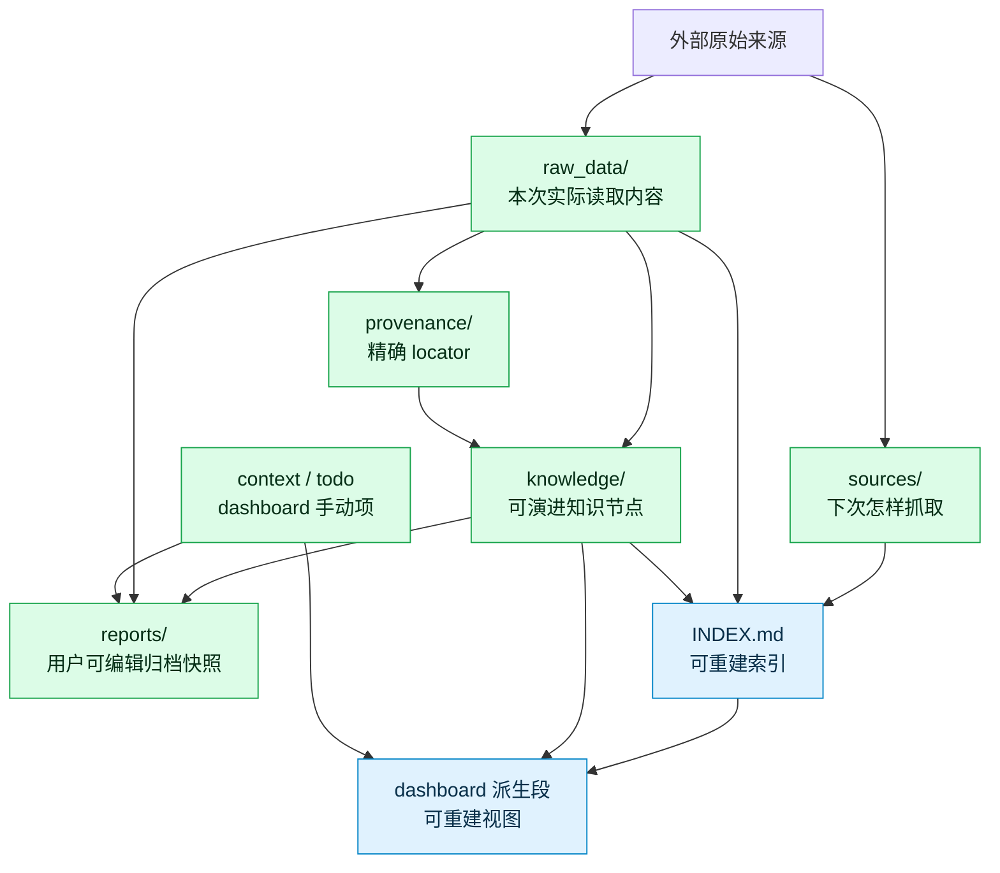

真相源损坏时不能靠 INDEX 反推修复；INDEX 或 dashboard 派生段不一致时，直接从真相源重建。

### 3.2 八类知识节点

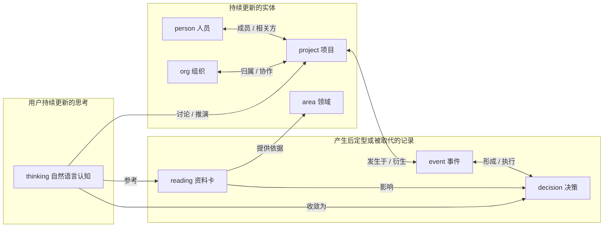

`thinking` 不走来源摄取事务：它由用户明确触发，按稳定主题创建或语义重写，使用最小
frontmatter 和自由正文；写入通过通用 KB mutation 原子维护双向 links、INDEX、journal 与
知识库本地 Git 回滚点。
`effective` thinking 可作为用户当前视角参与综合，`inactive` 只在明确查询历史时使用。

`person` 的实体消解与通讯录画像在 Agent 策略层和只读外部 helper 的边界完成：
`bin/resolve-users.sh --format json` 以来源中的精确 `open_id` 查询 lark-contact，返回版本化的
`byteworker-resolved-users/v1`；Agent 按 `feishu_id` 选择 person，并把同次查询的企业邮箱、
当前部门路径和核验时间写入完整候选。事务层只校验候选契约，不调用通讯录。部门路径是可变属性，
不是 provider-neutral org id；空结果不清除旧值，只有明确匹配已有 org 时才连边。

## 4. 代码层面的模块架构

### 4.1 分层与依赖方向

代码只允许从上层调用下层；底层不得反向依赖 Agent 策略：

```mermaid
flowchart TB
    subgraph L0["L0 · Agent 策略层"]
        SK["SKILL.md"]
        RF["references/*.md"]
        TM["templates/*"]
    end

    subgraph L1["L1 · 稳定入口层"]
        CLI["bin/byteworker-cli.py"]
        MP["lib/machine_protocol.py"]
        DIRECT["bin/*.py / bin/*.sh<br/>人工排障与兼容入口"]
    end

    subgraph L2["L2 · 应用服务层"]
        DT["lib/digest_txn.py"]
        KQ["lib/kb_query.py"]
        SO["lib/source_operations.py"]
        SCO["lib/source_chat_operations.py"]
        WX["lib/wiki_explorer.py<br/>惰性 Wiki 树探索"]
        DJ["lib/digest_jobs.py<br/>持久批次与租约"]
        RA["lib/report_automation.py<br/>自动报告状态、单租约与缺口判定"]
        DR["lib/dreaming_scheduler.py<br/>可选 Dreaming 启停、调度与回执"]
        DST["lib/dreaming_state.py<br/>v2 local state、权限、锁与迁移"]
        DRL["lib/dreaming_run_log.py<br/>结构化运行日志、轮转与查询"]
        DM["lib/dreaming_models.py<br/>跨阶段结构契约校验"]
        DG["lib/dreaming_grants.py<br/>IM grant 与撤销清理"]
        DC["lib/dreaming_collection.py<br/>窗口、coverage、gap 与去重"]
        DB["lib/dreaming_batch.py<br/>manifest、receipt、commit 与 cursor"]
        DFI["lib/dreaming_collectors/feishu_im.py<br/>lark-cli user adapter"]
        DA["lib/dreaming_analysis.py<br/>Finding/evidence/grant 校验"]
        DCO["lib/dreaming_consolidation.py<br/>history、投影与幂等 revision"]
        DPR["lib/dreaming_process.py<br/>process commit 编排"]
        DAP["lib/dreaming_action_policy.py<br/>有限动作与确定性门禁"]
        DAL["lib/dreaming_action_ledger.py<br/>claim fencing 与 receipt reconcile"]
        DREP["lib/dreaming_reports.py<br/>窗口、coverage、packet、outbox"]
        DRB["lib/dreaming_report_bundle.py<br/>结构化报告校验与通用产物渲染"]
        DDL["lib/dreaming_delivery_lark.py<br/>飞书机器人摘要投递 adapter"]
        ROWN["lib/report_owner.py<br/>跨 scheduler owner migration lock"]
        DEV["lib/dreaming_evaluation.py<br/>私有 shadow 指标与产品门槛"]
        DOC["lib/doctor.py"]
        DS["lib/doctor_sources.py<br/>来源契约只读审计"]
        PB["lib/provenance_backfill.py"]
        UP["lib/update_postflight.py"]
        KM["lib/kb_mutation.py<br/>非 digest 内容事务"]
        CV["lib/context_view.py<br/>按意图投影"]
    end

    subgraph L3["L3 · 领域契约层"]
        SRC["lib/sources/<br/>Bundle / Adapter / Registry / Projection"]
        PR["lib/provenance.py"]
        SP["lib/source_profiles.py"]
        SPP["lib/source_profile_providers.py"]
        SPC["lib/source_profile_contract.py"]
        SEM["lib/semantic_policy.py"]
        CRED["lib/credential_safety.py"]
        SS["lib/snapshot_store.py"]
        FM["lib/frontmatter.py"]
        CO["lib/constants.py"]
    end

    subgraph L4["L4 · Provider 与系统基础设施"]
        SC["lib/source_capture.py<br/>兼容 capture 实现"]
        AE["lib/aeolus_client.py"]
        KWT["lib/kb_write_txn.py<br/>共享写锁/回滚原语"]
        EXT["lark-cli / meegle / HTTP / Git / filesystem"]
    end

    subgraph L5["L5 · 私有持久化"]
        KB["知识库 Markdown / JSON / 本地 Git"]
    end

    SK --> CLI
    RF --> DIRECT
    TM --> DIRECT
    CLI --> DIRECT
    CLI --> MP
    DIRECT --> DT
    DIRECT --> KQ
    DIRECT --> SO
    DIRECT --> WX
    DIRECT --> DJ
    DIRECT --> RA
    DIRECT --> DR
    DR --> DST
    DR --> DRL
    DRL --> DST
    DIRECT --> DG
    DIRECT --> DC
    DIRECT --> DB
    DIRECT --> DPR
    DIRECT --> DAP
    DIRECT --> DAL
    DIRECT --> DREP
    DIRECT --> DRB
    DIRECT --> DDL
    DIRECT --> DEV
    DC --> DB
    DC --> DFI
    DG --> DST
    DB --> DST
    DPR --> DA
    DPR --> DCO
    DPR --> DB
    DA --> DM
    DCO --> DST
    DAP --> DCO
    DAP --> DA
    DAL --> DST
    DREP --> DCO
    DREP --> DST
    DRB --> DST
    DDL --> DREP
    DDL --> DST
    DDL --> EXT
    DR --> ROWN
    RA --> ROWN
    DFI --> EXT
    SO --> SCO
    DIRECT --> DOC
    DIRECT --> PB
    DIRECT --> KM
    DIRECT --> CV
    DIRECT --> SEM
    DT --> SRC
    DT --> PR
    DT --> SS
    KQ --> SRC
    KQ --> PR
    SO --> SP
    WX --> SP
    WX --> EXT
    WX --> KB
    DJ --> FM
    DJ --> KB
    RA --> KB
    DR --> KB
    SP --> SPP
    SP --> SPC
    SPP --> SPC
    SP --> CRED
    SRC --> CRED
    SO --> SC
    SS --> SC
    SC --> AE
    SC --> EXT
    DT --> KB
    DT --> KWT
    PB --> KWT
    SP --> KWT
    UP --> KWT
    KM --> KWT
    KWT --> KB
    KQ --> KB
    DOC --> KB
    PB --> KB
    UP --> DOC
    PR --> KB
    SP --> KB
    SS --> KB
```

约束含义：

- `digest_txn.py` 和 `kb_query.py` 是 provider-neutral core，不得新增
  `if source_type == "..."`。
- provider 特例只能进入 source adapter、operation adapter 或明确标注的 legacy compatibility
  模块。
- `bin/source.py` 必须保持薄，只负责参数和 registry 分发。
- CLI 不承载业务语义；Agent 不复制确定性实现。

### 4.2 入口层

| 模块 | 职责 | 输出 |
|---|---|---|
| `bin/byteworker` + `bin/byteworker-launcher.py` | shell 先定位 Python 并完成 update-check，再 exec 当前版本 launcher；统一执行 preflight、机器 CLI 或外部工具 | 单一版本模块、静默健康路径、机器 envelope 或下游输出 |
| `bin/session-preflight.py` + `lib/session_preflight.py` | 每 session 一次编排 KB、runtime、Todo 与自动报告设置检查，消费 shell 的有限更新 notice | `byteworker-session-preflight/v1`；默认仅异常输出 |
| `lib/runtime_deps.py` | 解析/探测 Python、Node、lark-cli、meegle 与核心命令，构造子进程环境 | `byteworker-runtime-check/v1` |
| `bin/byteworker-cli.py` | 所有确定性工具的统一 facade；子进程调用直接 CLI | `byteworker-cli/v1` envelope |
| `lib/machine_protocol.py` | 构造 `status/data/error/context`，稳定 error code 和上下文 | 单行或 pretty JSON |
| `bin/digest-txn.py` | digest 的 preflight / validate / execute / snapshot-node | transaction report/receipt |
| `bin/source.py` | capabilities / auth / inspect / capture / bundle-spec / bundle / profile / diff 参数入口 | request 契约、capture、SourceBundle、profile receipt、ChangeSet |
| `bin/wiki.py` | 按需 Wiki user-auth / inspect / tree scan / topics / candidates / subtree profile | 有限摘要、树状态、候选文件、profile receipt |
| `bin/digest-job.py` | 已确认多页 digest 的 create/list/status/lease/mark/reconcile/cancel | 有限批次与进度回执 |
| `bin/report-automation.py` | 自动报告 status/decision/configure/check/lease/complete；不创建宿主任务 | 设置状态、缺口判定、租约与真实运行回执 |
| `bin/dreaming.py` | Dreaming 控制面，以及 grant set-im、process prepare/abort | job/grant 回执与不含正文的 batch 摘要 |
| `bin/viewer-server.py` | 127.0.0.1 本地 viewer 静态服务与 token-gated `/api/settings` | JSON 设置视图、受控 PATCH 回执；不提供任意文件写入 |
| `bin/index.py` | INDEX rebuild dry-run/apply 的机器协议入口；不承担 journal/Git 收尾 | 变化/hash/副作用回执 |
| `bin/kb-mutate.py` | validate/execute 非 digest mutation plan | validation report / committed receipt |
| `bin/context.py` | 按 intent 读取有限 context 投影 | `byteworker-context-view/v1` |
| `bin/semantic.py` | 校验 IM 等结构化语义结果 | validation report / 稳定 error code |
| `bin/kb-query.py` | search / evidence / source-record | 有覆盖信息的有限候选 |
| `bin/doctor.py` | scan / fix | finding 与修复回执 |
| `bin/todo.py` | Todo 的确定性存储与时间操作 | Todo 状态 |
| `bin/resolve-users.sh` | 按 open_id 只读解析 person 身份与当前通讯录画像；默认 TSV 兼容旧调用 | `byteworker-resolved-users/v1` JSON 或兼容三列 TSV |
| 其它 `bin/*.sh` | 外部拉取、索引/links 重建、viewer、安装与更新辅助 | 明确的文件或 JSON/文本回执 |

机器协议只统一执行边界，不做插件发现，也不改变底层业务语义。

### 4.3 Source 子系统

Source 子系统允许 provider 内部异构，但交给事务层的边界必须统一：

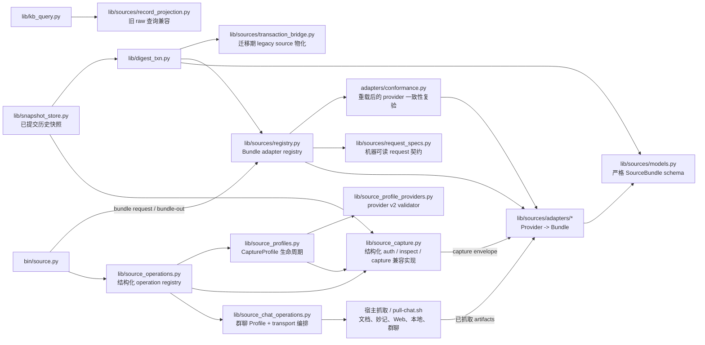

当前真实能力按三个正交集合声明，调用方通过 `source capabilities` 查询，不能把“已支持
Bundle”误认为“也必须有同形态网络 capture”：

| 能力 | 当前来源 | 边界 |
|---|---|---|
| operation | `meego`、`feishu_base`、`aeolus`、`feishu_chat` | 前三类提供结构化 auth/inspect/capture；群聊用 Profile 包装 `pull-chat.sh` 完整分页 |
| Profile | `meego`、`feishu_base`、`feishu_chat`、`feishu_doc`、`feishu_wiki`；兼容 `aeolus` v1 | Base/Chat/Doc/Meego/Wiki 使用 v2；Wiki 仅描述监控子树；Aeolus 保留 v1 |
| Bundle adapter | `meego`、`feishu_base`、`aeolus`、`feishu_chat`、`feishu_doc`、`feishu_minutes`、`web`、`local_md` | 所有单来源统一输出 `SourceBundle v2` |

- Meego/Base/Aeolus 可用 `capture --bundle-out` 从完整 capture 同步产生 Bundle。
- Meego `inspect / capture` 对空间主页返回 `SOURCE_SELECTION_REQUIRED`，不生成 Bundle 或
  Profile，也不发起网络业务读取；用户提供具体 Story View URL 后才进入标准 inspect / capture。
- `capture --bundle-out` 必须先在内存中完成 Bundle 校验，再预检并暂存两个不同的输出路径；
  第二个替换失败时恢复第一个文件，且拒绝 `--out` 与 `--bundle-out` 指向同一路径。通用
  `bundle request` 只接受 `capture_path`，拒绝同时存在的内联 capture，避免两份内容真相。
- 群聊的 Profile capture 直接输出 Bundle，并把逐字稿和 locator artifact 保存在 Bundle
  旁的业务临时目录。
- 群聊 operation 单独位于 `lib/source_chat_operations.py`；它复用 `pull-chat.sh`，避免把
  高水位、transcript/locator 编排继续堆进结构化 `source_operations.py`。
- 飞书文档、妙记、Web 和本地文件由宿主能力先抓取原始 artifact，再用
  `source bundle --source-type ... --request ... --out ...` 进入同一边界。
- `source bundle-spec --source-type ...` 从 adapter builder 实际签名生成顶层必填/可选字段
  （排除仅供内部 capture 直传的 `capture/skill_root`），并附 adapter 层维护的
  artifact/component/source UID 规则；调用方不得靠猜测构造 request。
  `--request` 只接受临时或 KB 内 JSON 文件路径，内联 JSON 和不存在路径使用不同稳定错误码。
- `feishu_meeting` 是日历、妙记、投屏文档组成的复合编排，不注册伪造的单来源 adapter；
  各物件先各自产生 Bundle，再由 meeting/batch 流程组合。
- `source_capture.py` 暂时是结构化来源兼容实现，不应继续吸收
  transaction/query/CLI 分支。

#### 4.3.1 最终领域模型

Source 子系统统一的是交接契约，不是 provider 的内容结构：

| 术语 | 最终定义 | 关键边界 |
|---|---|---|
| `SourceRef` | `source_type/source_uid/source_url/title/revision` 组成的稳定来源身份 | revision 可空；UID 不随一次抓取变化 |
| `CaptureProfile` | `selector/capture_policy/routine` 描述“下次怎样读” | 不保存凭据和抓取结果；显式修改产生新 revision |
| `SourceCapabilities` | adapter 对 component kind、coverage、稳定记录 ID、record index 和 diff 能力的真实声明 | `record_index` 或 incremental diff 必须以稳定记录 ID 为前提 |
| `SourceBundle` | 本次实际读到的 identity、components、coverage、anchors、provider metadata 和可选 record index | 是进入 digest 的唯一来源交接；不定义统一正文 AST |
| `SnapshotStore` | 从不可变 raw 中定位最新或显式历史的、已提交且完整的 snapshot | 返回 raw/path/ingested/source 等出处；坏 raw、身份不符、未提交 raw 均 fail closed |
| `ChangeSet` | baseline、added、changed、left_view 等有限变化集合 | `left_view` 只表示离开当前视图，不等于删除或取消 |
| `DigestPlan` | Agent 对节点、evidence、journal 和 commit 的完整写入决策 | v2 只引用 Bundle，不复制 source identity 或 anchors |

`SourceBundle.components` 保留 provider 自身形态：文档可以是 body/comments/whiteboard，
群聊和妙记是 transcript，Web/本地资料是 body，结构化来源是 canonical records snapshot。
component 使用 `verbatim` 或 `canonical-json` 模式；两者都可用 JSON Pointer 选择 wrapper
内值，但 verbatim 目标必须是字符串，canonical-json 则规范序列化选中值。不为了“统一”而把
飞书文档、Meego、Base、风神压成同一个内容 AST。

飞书 whiteboard component 只包含结构化节点 JSON。抓取和语义层都不生成、读取或分析预览图片；
坐标、尺寸、父子关系和 connector 可作为结构证据，只有渲染后才能观察到的外观语义保持未知。
这不改变 whiteboard component/hash schema，因此历史 raw 无需迁移。

通用 schema 校验只证明 envelope 合法，不证明字段仍然忠于 provider。Bundle 从磁盘重载并
进入事务前，registry 必须调用 adapter 的 `validate_bundle`：结构化来源从唯一的
`snapshot` component 重新构造期望 Bundle，并复验 identity、coordinates、coverage、
anchors、record index 和 `snapshot_hash`。事务派生的 `payload_hash` 单独由事务复算，不参与
provider 一致性比较。任何差异都必须在写 raw 之前 fail closed。

Hash 语义必须区分：

| Hash | 表示什么 | 用途 |
|---|---|---|
| component digest | 单个 component 规范字节的 SHA-256 | 独立判断正文、评论、白板或 records 是否变化 |
| `snapshot_hash` | 结构化 records snapshot 自身 | 结构化来源快速比较完整视图 |
| `payload_hash` / raw `content_hash` | 事务对全部 components 重算后的组合 hash | 同源版本判重与 Bundle 完整性复验 |
| `digest_key` | 来源身份与实际 payload 组合后的幂等键 | `noop/new_version/resume_failed` 判定 |

#### 4.3.2 Profile、快照与查询的最终规则

- v2 Profile 的公共生命周期由 `lib/source_profiles.py` 管理，当前覆盖 Meego、Base、
  群聊、飞书文档和 Wiki 子树；provider validator 严格校验
  selector 和 capture policy；未知字段、未知 provider、凭据字段全部拒绝。
- `sources/` 历史上还可能含不属于 CaptureProfile 的日历/调度配置；枚举时只忽略“无 Profile
  schema 且 source_type 不受 Profile 支持”的明确异类文件。任何声称为受支持 source type 的
  畸形 Profile 仍 fail closed，不能借兼容过滤隐藏。
- Base/群聊等新增 provider 规则放在 `lib/source_profile_providers.py`，避免 Profile 的
  持久化、revision 和 Git 生命周期继续吸收 provider 分支。provider validator 只依赖
  `source_profile_contract.py` 的中立错误类型，不反向 import 生命周期模块。
- `credential_safety.py` 对 Profile 与 Bundle 统一拒绝 URL userinfo、query/fragment 中编码或
  分隔符变体的认证字段，同时允许 `app_token/root_node_token` 等明确资源标识。
- 群聊的一次性显式窗口与 routine 增量 Profile 分开：启用 routine 必须使用
  `since_last=true`；高水位来自已提交 raw，Profile 只保存策略和 overlap。
- routine 优先且只按已注册 Profile 重放配置；没有 Profile 的历史来源才允许兼容读取 raw 上的
  routine。已有 Profile 时禁止从最近 raw 猜测或拼接抓取参数。
- `SnapshotStore` 默认选择同一 `source_type + source_uid` 最新的已提交完整 raw，也支持
  `raw_id` 或历史序号显式选择；current capture 与 previous snapshot 必须身份一致。
- collection adapter 可生成
  `record_id/title/source_time/locator/fields` 的 `byteworker-record-index/v1`。
  查询优先使用这个 provider-neutral 投影，完整 provider payload 继续作为 raw component 保留。
- 旧 raw 没有 record index 时，仅由 `lib/sources/record_projection.py` 做 Meego/Base/Aeolus
  兼容投影；新增 provider 不得因此修改 `lib/kb_query.py`。
- 迁移期 legacy frontmatter/source 字段仅由 `lib/sources/transaction_bridge.py` 物化；
  provider 规则不得重新散回 transaction core。

### 4.4 Wiki 探索与批量任务

Wiki 空间探索是独立应用服务，不是假装成正文 capture provider：

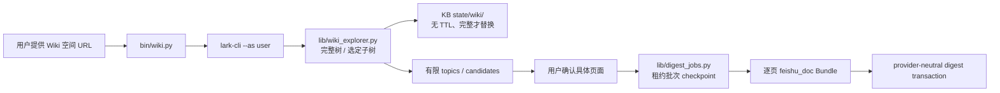

职责与边界：

- `lib/wiki_explorer.py` 负责 lark-cli user adapter、真实 `space_id/node_token` 解析、BFS、
  coverage/tree hash、原子状态替换、有限主题汇总和候选页元数据筛选。
- 全空间必须列 `space_id` 根节点，不能用首页 `has_child` 决定是否有树；子树根则至少尝试一次
  child list。分页或任一节点请求失败、超过 `max_nodes`、被 `max_depth` 截断都不替换完整状态。
- baseline 没有 TTL，普通启动与 routine 都不自动刷新整空间。`feishu_wiki` Profile 只监控用户
  确认的 `space_id + root_node_token` 子树；默认只比较结构。
- `lib/digest_jobs.py` 只保存用户确认的页面身份、状态、租约和事务 receipt 定位。它不读取 Wiki
  正文、不写知识节点；事务提交和任务标记之间的崩溃窗口由 committed raw reconcile。
- 页面仍逐个进入既有 `feishu_doc` adapter 与事务。因此 Wiki 不进入 operation/Bundle 集合，
  也不允许修改 `lib/digest_txn.py` 或 `lib/kb_query.py` 解析树/job 私有格式。
- `bin/byteworker-cli.py` 仅通过子进程映射暴露 `wiki` / `digest-job`。普通路径不 import 这两个
  模块，不检查 auth、不扫描状态、不创建目录；这是冷路径兼容契约。

### 4.5 写事务

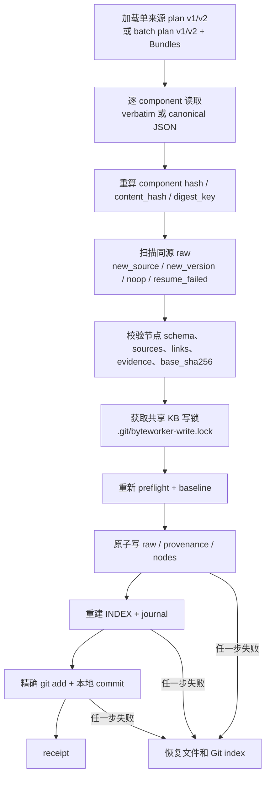

digest、Profile、provenance backfill、postflight、Todo 和通用 mutation 全部使用
`lib/kb_write_txn.py` 的同一个 advisory lock；不能再为不同 writer 创建互不相见的锁。

digest 之外的 update/context/dashboard/report 使用 `byteworker-kb-mutation/v1`；thinking 复用
`update` operation：
Agent 提供候选、目标 `base_sha256`、章节模式、冲突处置、journal 摘要和 commit message；
`lib/kb_mutation.py` 在锁内重新校验，执行完整替换/固定章节替换/保留手动章节替换，按需重建
INDEX，并统一完成 journal、精确暂存、commit 和 rollback。它不允许写 raw/provenance/sources/
todo。

postflight 在共享锁内扫描和修复；repair、路径检查、暂存、commit 或 receipt 失败时恢复目标文件、
Git index 和必要的 HEAD ref。事务成功的唯一证明是 `status=committed` 和 commit hash。Agent
已生成候选、validate 成功或文件看起来存在，都不等于事务完成。

标准 digest 在 plan 完成后直接调用 execute；execute 在任何写入前完成完整 validate，并在写锁内
再次复验。独立 validate 保留为失败诊断入口，不是标准成功路径。receipt 之后只允许一次紧凑的
HEAD/INDEX/工作区核验，不把 raw、provenance、候选、节点正文或完整 diff 重新送回 Agent。

### 4.6 查询、语义校验与维护

| 模块 | 核心职责 | 允许写入 |
|---|---|---|
| `lib/kb_query.py` | 无持久数据库的节点召回、一跳扩展、evidence 和结构化记录查询 | 否 |
| `lib/context_view.py` | 解析固定 context 章节并按 intent 返回有预算投影 | 否 |
| `lib/semantic_policy.py` | 校验 IM 分数、阈值、reason code 和 message evidence | 否 |
| `lib/kb_mutation.py` | 非 digest plan 校验、章节处理和统一事务提交 | 仅显式 execute |
| `bin/todo.py` | Todo 解析、状态变更及共享锁内 journal/commit/rollback | 写命令显式执行 |
| `lib/provenance.py` | anchor schema、sidecar、节点 `[E]` 物化、raw 扫描 | 仅由事务调用 |
| `lib/provenance_backfill.py` | 历史出处 audit → plan → validate → apply | 仅显式 apply |
| `lib/doctor.py` | 编排布局、节点、raw、provenance、links、报告、INDEX 与来源契约扫描 | scan 否；fix 受白名单限制 |
| `lib/doctor_sources.py` | 只读检测 Profile/routine 覆盖、raw/Profile 绑定、payload component/digest key 与 record index 漂移 | 否 |
| `bin/rebuild_index.py` | 从真相源重建 INDEX | 是，可确定重建 |
| `bin/index.py` | INDEX 预演/执行 facade；apply 复用 postflight 事务 | INDEX、journal、本地 commit |
| `bin/repair_links.py` | links 修复底层执行器；Agent 通过 `doctor fix` 调用 | 仅由受保护事务调用 |
| `lib/update_postflight.py` | 代码真实更新后编排 doctor auto-fix | 是，仅确定性 finding |
| `lib/report_automation.py` | 自动报告一次性引导、local-only 配置、运行轨迹、缺口判定与跨报告租约 | 仅写 Git 排除的 `state/report_automation.json` |
| `lib/settings.py` | 面向用户和 viewer 的统一配置 façade；汇总 `.kbconfig`、`sources/`、`context.md`、自动报告和 Dreaming 状态 | 不自建新 truth source；更新只委派给既有 writer |
| `lib/dreaming_state.py` | `byteworker-dreaming/v2` 安全路径、`0700/0600`、共享 state lock、原子 JSON 与 v1→v2 迁移 | 仅写 Git 排除的 `state/dreaming/` |
| `lib/dreaming_models.py` | EvidenceBatch、batch、FindingBundle、ActionPlan、ActionClaim 的结构校验 | 否 |
| `lib/dreaming_scheduler.py` | 能力导览/运行计划/机器条件三启用闸门、interval/daily/every-N-days、next due、harness truth、fairness、退避、lease/heartbeat、maintenance 与报告 owner 冲突 | 通过 `dreaming_state.py` 写 local state |
| `lib/dreaming_run_log.py` | 每个 run 的 leased/heartbeat/renewed/completed/expired 事件、白名单 metrics、按日/大小轮转、保留期清理与 list/show/tail | `state/dreaming/run-logs/*.jsonl`，仅 `0600` 元数据 |
| `lib/dreaming_grants.py` | IM off/monitored/all_visible、persist_finding revision 与降级清理 | grant state、撤销范围内 spool/batch |
| `lib/dreaming_collectors/feishu_im.py` | user identity 的 queryless discovery 和逐 chat 分页；provider response 规范化 | 否 |
| `lib/dreaming_collection.py` | 时间窗口、Profile 选择、message revision 去重、coverage 与时间切片 gap | collected batch |
| `lib/dreaming_batch.py` | 私密 spool、immutable manifest、stage receipt、commit marker、cursor/recovery、TTL GC | `state/dreaming/{spool,batches}` 与 v2 索引 |
| `lib/dreaming_analysis.py` | FindingBundle schema、batch/hash、evidence ref 和 grant revision 复验 | 否 |
| `lib/dreaming_consolidation.py` | Finding event history、当前投影、跨 batch revision、重建和 grant purge | 私密 Finding state |
| `lib/dreaming_process.py` | analysis receipt、可选 consolidation、batch commit/cursor 的幂等编排 | 仅通过 analysis/consolidation/batch owner |
| `lib/dreaming_action_policy.py` | 有限 action kind、Finding/evidence/coverage、确认与 report/archive/alert grant 门禁 | 否 |
| `lib/dreaming_action_ledger.py` | planned/confirm/claimed/committed/cancelled/reconcile、lease epoch fencing、下游 receipt 对账 | 私密 action state 与 v2 索引 |
| `lib/dreaming_reports.py` | morning/daily/weekly 窗口、coverage dependency、私密 packet、owner readiness 与 delivery outbox | 私密 report packet、dependency、outbox |
| `lib/dreaming_report_bundle.py` | 校验单一结构化报告并确定性渲染 summary、内部 Markdown、自包含 HTML 和宿主无关 manifest | `state/dreaming/reports/<kind>-<period>/artifacts/` 私密产物 |
| `lib/dreaming_delivery_lark.py` | 读取已渲染摘要，通过应用机器人 adapter 投递，并以真实 `message_id` 完成 outbox | 仅更新 delivery receipt |
| `lib/report_owner.py` | legacy/Dreaming owner migration 的共同 advisory lock | 仅 `state/report-owner.lock` |
| `lib/dreaming_evaluation.py` | KB/仓库外 Golden/legacy/Dreaming ID 对比、分层 recall 与两周门槛 | 私有评估目录 metrics/history |

## 5. 跨层契约

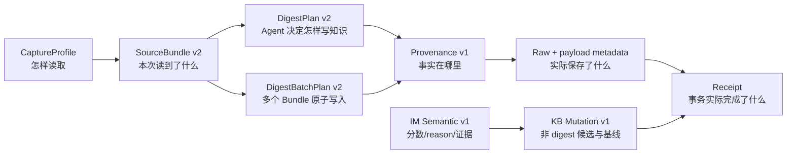

| 契约 | 所有者 | 关键不变量 |
|---|---|---|
| `byteworker-source-profile/v2` | `source_profiles.py` + 对应 adapter | 无凭据；selector 与 source UID 一致；revision 可重算 |
| `byteworker-source-bundle/v2` | `sources/models.py` | identity、components、coverage、anchors 唯一交接；业务路径不在 skill 仓库 |
| `digest-plan/v2` | Agent + `digest_txn.py` | 只引用 Bundle，不复制 source/anchors；节点候选必须完整 |
| `digest-batch-plan/v2` | Agent + `digest_txn.py` | `inputs[]` 各引用一个 Bundle；禁止复制 source/anchors；全部输入同成同败 |
| `byteworker-kb-mutation/v1` | Agent + `kb_mutation.py` | 路径白名单、base hash、冲突处置、章节保留、journal/commit 同成同败 |
| `byteworker-im-semantic/v1` | Agent + `semantic_policy.py` | 0..4 分数、固定阈值、reason code、message evidence；验证后才能写 |
| `byteworker-context-view/v1` | `context_view.py` | 固定 intent/章节、显式字符预算，不静默截断 |
| `byteworker-workflow-routes/v1` | `SKILL.md` + route contract tests | 独立入口闭包可递归展开、文件存在、场景预算受控 |
| `byteworker-provenance/v1` | `provenance.py` | anchor 可解析；绑定 raw content hash；关键事实 `[E]` 可回原文 |
| `byteworker-record-index/v1` | `sources/models.py` + collection adapter + transaction | provider-neutral 有限查询投影；原 provider snapshot 仍保留 |
| `byteworker-wiki-tree-state/v1` | `wiki_explorer.py` | 完整 coverage 才替换；无 TTL；不进入 raw/实体图/LLM 输出 |
| `byteworker-digest-job/v1` | `digest_jobs.py` | 用户确认页面；小批租约；committed/noop 以事务事实为准 |
| `byteworker-report-automation/v1` | `report_automation.py` | 宿主任务是真相源；local-only；last attempt/run/success 可恢复；check 只对未成功 period 返回 due；单租约防重叠 |
| `byteworker-settings/v1` | `settings.py` + viewer API | 配置聚合视图，不替代底层 truth source；viewer 只可修改 Dreaming 安全开关/频率/日志/摘要/本地任务偏好和 Source Profile routine；旧自动报告只读 |
| `byteworker-dreaming/v2` | `dreaming_state.py` + `dreaming_scheduler.py` | 缺失即关闭；v1 原子备份后迁移；`0700/0600`；schedule/harness/harness_preferences/logging/grant/job/run/cursor/gap/receipt；enabled 与 operational 分离；默认不接管报告 |
| `byteworker-dreaming-run-event/v1` | `dreaming_run_log.py` | 稳定 run_id；事件/stage/metrics 白名单；无业务正文；独立日志锁、5 MiB 轮转与 1..365 天保留 |
| Dreaming 跨阶段结构契约 | `dreaming_models.py` | schema 白名单、必填结构、枚举和 evidence ref 形状；不复刻业务语义 |
| `byteworker-evidence-batch/v1` | `dreaming_collection.py` + `dreaming_batch.py` | principal/grant revision、窗口、coverage、message anchors、私密 spool refs |
| `byteworker-dreaming-batch/v1` | `dreaming_batch.py` | collected→analyzed→consolidated→committed/aborted；commit marker 先于 cursor |
| `byteworker-finding-bundle/v1` | Agent + `dreaming_analysis.py` | 当前 batch id、合法 kind/confidence、非空 evidence refs 且全部来自 manifest |
| `byteworker-findings/v1` | `dreaming_consolidation.py` | history 是恢复源、projection 可重建；事件键 `batch_id+finding_id` 幂等 |
| `byteworker-action-plan/v1` | Agent + `dreaming_action_policy.py` | action kind 白名单；policy_result、确认、recapture 和 coverage 由 Python 重算 |
| `byteworker-action-claim/v1` | `dreaming_action_ledger.py` | run/lease epoch/grant revision 绑定；dedupe key；真实下游 receipt 后才 committed |
| `byteworker-report-document/v1` | Agent + `dreaming_report_bundle.py` | 单一语义结果；300–500 字消息摘要；章节引用只能指向已声明来源 |
| `byteworker-report-artifacts/v1` | `dreaming_report_bundle.py` | 四类本地产物路径、media type、audience 与 hash；HTML 预览不要求宿主私有 API |
| `byteworker-finding-event/v1` | `dreaming_consolidation.py` | proposal/feedback 事件；request-id 幂等；projection 可重建 |
| `byteworker-shadow-evaluation/v1` | `dreaming_evaluation.py` | 只含指标与 sample IDs；评估输入拒绝业务文本字段 |
| `byteworker-resolved-users/v1` | `bin/resolve-users.sh` | 精确 open_id 输入；身份失败不创建 person；部门为空不表示调动；`resolved_at` 带时区 |
| `byteworker-runtime-check/v1` | `runtime_deps.py` | 绝对 executable、可执行探测与同源 PATH；显式 override 无效时不静默 fallback |
| `byteworker-session-preflight/v1` | `session_preflight.py` | 健康无 notice；blocking 阻止依赖业务；Todo/迁移/更新只返回有限行动项 |
| `byteworker-cli/v1` | `machine_protocol.py` | 稳定 `status/data/error/context`，不泄漏完整 argv 或正文 |
| transaction receipt | `digest_txn.py` / `kb_mutation.py` | `committed/noop` 语义明确；写入和 commit 同成同败 |

doctor 不要求临时 `SourceBundle` 或 `DigestPlan` 在事务完成后继续存在，而是检查其落盘结果：
Profile schema/path、raw component 元数据和 digest key、Profile 绑定、record index、provenance
闭环。历史 routine 缺 Profile 按来源能力分级：Meego/Base/Aeolus/群聊缺失为 error，
飞书文档兼容 raw 但提示 warning；尚无 Profile schema 的来源才记兼容 info。任何 Profile 创建或迁移都
包含 selector/capture policy 的语义判断，因此不属于 `doctor fix` 或 post-update auto-fix。

## 6. 失败边界与安全策略

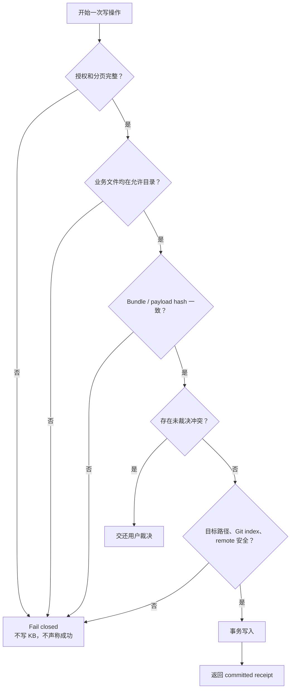

任何“不确定但继续写”的实现都违反本架构。权限不足、分页不完整、身份不一致、凭据污染、
hash 不一致、重复 ID、目标文件并发变化和 KB remote 都必须 fail closed。

URL 凭据污染包括 userinfo，以及 query/fragment 中大小写、百分号编码、连字符/下划线变体的认证
字段。所有 durable writer 先竞争同一个 KB 写锁；锁内必须重新检查 staged/dirty/baseline。
IM 阈值不一致、未知 reason code、缺 message evidence 和 context 超硬预算也必须 fail closed，
不能让 Agent 用自由文本解释绕过。

自动报告另有三条失败边界：任务只能在宿主本地环境中运行；任一 routine 来源的授权、分页或
digest 事务失败时不得继续生成“看似完整”的报告；报告、journal 或本地 Git 回滚点未完成时
不得记录成功。获取到其他运行中的有效租约时应安静退出并保留现有租约，不能并发写同一 KB。
Dreaming 报告核心只生成本地 summary、Markdown、HTML 和 manifest，不调用 TraeWork、Codex、
Claude Code 等宿主私有预览接口。HTML 必须自包含且不加载外部脚本、样式、字体、图片或网络
资源；宿主可自行预览，不能预览时返回本地文件链接。飞书发送失败只影响对应 outbox，不能删除
本地产物、回滚报告 commit 或声称已经送达。

Dreaming 另有八条边界：缺失状态必须等同关闭；未记录当前版本能力导览、完整运行计划或机器
运行要求确认时拒绝启用；`enabled=true` 但 harness 未登记时 `operational=false`，不能声称会
自动运行；TRAE IDE/TraeCode 不得创建或 register Dreaming 任务，TraeWork 等支持的宿主没有
真实任务与首次触发证据时也禁止 register；旧自动报告仍声明 enabled
时拒绝接管 daily/weekly；maintenance 只能调用 doctor
公开 facade 和 `auto_fix` 白名单，重要未决项必须等待用户；Dreaming 状态损坏、租约过期或 job 失败只影响
Dreaming，不得阻塞、回滚或改变 digest/search/update 和旧自动报告。`partial/failed` 不覆盖
job 的 `last_success`。v1→v2 迁移必须先写本地私密备份，再原子替换 state；未知 schema 或迁移
失败保持 Dreaming fail closed，不能猜写或影响其它能力。运行日志只能保存白名单元数据和计数，
不得保存 IM/Finding 正文、人员群名、URL、凭据、argv 或 stderr；日志失败不得被伪装为可审计成功。
交互向导不得把推荐值当作用户确认，不得因修改单项设置而清空其它已授权项，也不得把
`operational/persist_report/instant_alert/harness` 等内部名字作为面向用户的必答概念。

## 7. 怎样扩展而不让架构失控

### 7.1 新增一种来源

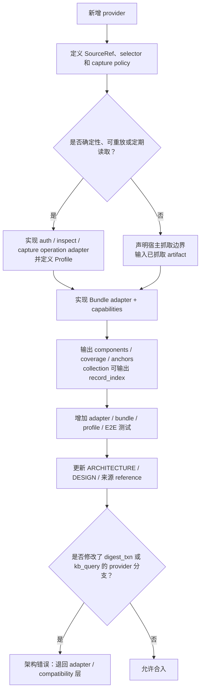

新增来源通常允许修改：

- `lib/source_operations.py` 或拆出的 provider operation adapter；
- `lib/sources/adapters/<provider>.py` 与 registry；
- `lib/source_profiles.py` 的 provider validator；
- 对应 `references/digest-<provider>.md`；
- tests 和本文件。

“统一”要求所有单来源最终进入 Bundle registry，但不要求所有来源拥有相同 transport：
结构化保存视图、群聊等确定性例行来源进入 operation/Profile；浏览器正文、妙记宿主产物等
先由宿主能力抓取，再由薄 adapter 校验。只有真实可重放的 selector/capture policy 才能写
Profile，不能为了矩阵好看而保存不可执行配置。

通常不允许修改：

- `lib/digest_txn.py` 来加入 provider 名称判断；
- `lib/kb_query.py` 来解析新的 provider 私有结构；
- `bin/source.py` 加一串新的 provider 条件分支。

### 7.2 新增命令或写流程

1. 先判断它属于 Agent 语义、确定性应用服务还是纯维护工具。
2. 确定性命令通过 `bin/byteworker-cli.py` 暴露统一 envelope。
3. 外部来源写 raw/节点必须复用 digest transaction；无新来源的节点更新和
   context/dashboard/report 写入必须复用 KB mutation；可重建且不提交的派生预览可使用独立工具。
4. 新的真相源字段或目录必须先修改 `DESIGN.md`。
5. 新的主流程或模块依赖必须同时修改本文件。

### 7.3 禁止的演进方式

- 在 skill 仓库生成带业务内容的一次性脚本、plan、capture 或候选节点。
- 因为某个 provider 特殊，就把特殊字段一路泄漏到 transaction、query 和 viewer。
- 绕过 Bundle，把多个不同 source manifest 结构直接交给 Agent 猜。
- 绕过 transaction 手工改 raw、provenance、知识节点、INDEX 和 journal，却仍声称原子完成。
- 为新的 KB writer 创建私有 lock，或让 Agent 手工执行 journal/git 收尾。
- 在多个 reference 重复定义冲突、晋升或评分动作，而不是引用唯一 policy。
- 用文档或最近 raw 猜一个已经有 profile 的结构化来源配置。
- 默认把结构化视图每一行变成实体节点。
- 查询时把整个大型 raw 交给 Agent，而不是使用 `source-record` 有限召回。
- 只修改代码不更新架构文档和契约测试。

## 8. 架构治理：每次开发必须执行

### 8.1 变更判断

以下任一项发生变化，都必须在同一个 commit 中更新本文件：

- 用户信息处理流程、失败路径或成功判定发生变化；
- 新增、删除、重命名 `bin/` 或 `lib/` 的核心模块；
- 模块职责、依赖方向或 provider 边界发生变化；
- SourceBundle、Profile、DigestPlan、Provenance、record index 或机器协议发生变化；
- 真相源、派生物、知识库目录或写入事务发生变化；
- 新增一种来源、新命令或新的持久化流程。

仅修改文案、CSS、单个模板展示且不影响上述边界时，可以不改架构图，但仍需确认本文件未失真。

### 8.2 Definition of Done

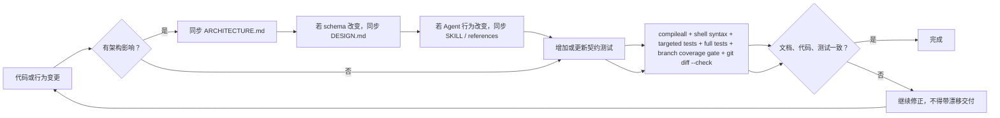

coding agent 在修改代码前应先阅读本文件相关章节；完成后必须在交付说明中明确：

- 是否改变架构；
- 更新了哪些架构图或为何不需要更新；
- 哪些测试证明实现与文档一致；
- 是否保留兼容层或新增技术债务。

覆盖率由根目录 `.coveragerc` 统一定义：统计 `bin/`、`lib/` 的 Python line/branch coverage，
并通过 coverage.py 的 `subprocess` patch 合并 CLI 子进程数据。CI 固定安装 Node.js 与 `jq`，
执行 viewer runtime、shell 行为与 Python 测试，最后用 `coverage report` 应用最低门禁；
测试不得仅靠 mock 覆盖入口而跳过真实命令形态和退出码。

### 8.3 当前兼容边界和已知债务

这些是**有意保留的真实实现**，不能误删，也不能伪装成已经完成迁移：

| 兼容项 | 当前原因 | 删除条件 |
|---|---|---|
| `digest-plan/v1` | 旧单来源调用仍需读取 | 连续版本无 v1-only 调用且用户结束兼容窗口 |
| `digest-batch-plan/v1` | 旧多来源调用仍内联 legacy source | 连续版本无 v1-only 调用且用户结束兼容窗口 |
| Aeolus Profile v1 | 已部署 profile 使用旧结构 | doctor 可识别且真实旧 KB 验证通过 |
| `lib/source_capture.py` 单文件 | 保持旧 import 和成熟 capture 测试 | provider operation/transport 拆分完成且旧入口有兼容 facade |
| `transaction_bridge.py` | 为旧 raw/frontmatter 物化 provider 字段 | 新 raw/query 不再依赖 legacy 字段 |
| `record_projection.py` | 查询旧 Meego/Base/Aeolus snapshot | 兼容窗口结束或旧 raw 不再需要查询 |
| `resolve-users.sh` 默认三列 TSV | 已有人工/Agent 调用可能按 `open_id/姓名/feishu_id` 消费 | 调用方全部切到 `--format json` 且用户同意结束兼容窗口 |
| `update_postflight.py` 同时承载显式 doctor/index 维护事务 | 保留既有 post-update import/CLI，同时复用已验证 rollback 边界 | 后续有第二类维护 action 时再抽 `kb_maintenance.py`，不得复制事务 |
| `rebuild_index.py` / `repair_links.py` 直接入口 | doctor/index 事务内部执行器与人工底层排障兼容 | 所有 Agent/自动化调用稳定 facade 后，仍可作为内部执行器保留 |
| `lib/report_automation.py` 与 Dreaming 并存 | 既有用户仍由旧宿主任务生成日报/周报；Dreaming 默认不接管 | 显式 owner migration 完成、旧任务停用且兼容期结束 |

任何兼容项的删除还必须同时满足：

1. 连续发布版本中没有只支持旧契约的调用；
2. doctor 能识别旧 raw/profile，且不要求破坏性全库迁移；
3. 旧格式 fixture 和真实旧 KB 的只读验证都通过；
4. 用户明确同意结束兼容窗口。

### 8.4 架构验证矩阵

架构修改不能只验证“新路径能跑”，还要证明 provider 隔离、旧数据读取和失败边界没有退化：

| 层 | 最低验证范围 |
|---|---|
| Adapter / operation | auth、inspect、capture、完整分页、顺序稳定、URL 脱敏、稳定 ID |
| Bundle | schema、credential/path 防护、component、anchor、coverage、canonical hash、重载后的 provider 派生一致性 |
| Profile | v1/v2 兼容、revision、unknown field、URL/userinfo/编码凭据拒绝、非 Profile legacy 配置共存、validator 无反向 import |
| SnapshotStore | latest/history、坏 raw fail closed、source mismatch、baseline/diff |
| Transaction | digest/mutation/Todo、batch、no-op、新版本、共享跨进程锁、文件/index/HEAD rollback、章节保留、provenance |
| Query | canonical record index、legacy fallback、latest/history、exact anchor |
| Doctor | Profile v1/v2、routine 覆盖、raw/Profile identity、record index、legacy severity、postflight blocker |
| Session preflight | 更新先于 Python import、健康静默、blocking、更新 notice、Todo notice、报告迁移、PATH/NVM/显式 override |
| Agent route / semantic | workflow 闭包、独立入口自足、context 字符预算、冲突唯一 owner、IM 阈值/reason/evidence |
| 自动报告 | 首次/升级只询问一次、local-only 配置、宿主真相源、跨日报/周报租约、过期恢复、成功/失败回执、每次完整 routine digest |
| Dreaming | 默认关闭无状态写、三启用确认、三类 process schedule、next due、enabled/operational 分离、harness tick、run_id/heartbeat/log retention、due/idle/busy、fencing、旧报告 owner 冲突 |
| End-to-end | 结构化 capture → Bundle、群聊 Profile → Bundle、宿主 artifact → Bundle、会议妙记 + 文档 Bundles → batch 单 commit，以及 Bundle → commit → query/diff 闭环 |

`tests/test_architecture_contract.py` 固化文档入口和核心模块清单；
`tests/test_source_architecture.py` 固化 core 不含 provider 分支以及本节最终契约。

## 9. 目录导航

```text
byteworker/
├── ARCHITECTURE.md       # 本文件：流程和模块边界
├── SKILL.md              # Agent 行为入口
├── DESIGN.md             # 持久化 schema 与数据不变量
├── AGENTS.md             # coding agent 仓库铁律
├── references/           # 按场景加载的执行细则
├── templates/            # 节点、报告、plan、bundle 骨架；含 Dreaming 自包含 HTML 基础模板
├── bin/                  # CLI facade、直接入口和 shell 集成
├── lib/                  # 确定性 Python 实现
│   ├── runtime_deps.py   # Python/Node/内部 CLI 发现、探测与运行环境
│   ├── session_preflight.py # 每 session 一次的静默公共准备
│   ├── kb_write_txn.py   # durable writer 共享锁和回滚原语
│   ├── kb_mutation.py    # 非 digest 内容事务
│   ├── context_view.py   # 按意图裁剪 context
│   ├── semantic_policy.py # 可校验语义阈值
│   ├── doctor_sources.py # Profile/routine/raw 来源契约只读审计
│   ├── source_chat_operations.py # 群聊 Profile capture 与高水位 transport 编排
│   ├── source_profile_providers.py # v2 provider selector/capture-policy 校验
│   ├── wiki_explorer.py # 按需 Wiki 树状态、主题与页面候选
│   ├── digest_jobs.py # 已确认多页 digest 的租约 checkpoint
│   ├── report_automation.py # 自动报告设置状态与跨任务租约
│   ├── settings.py # 统一配置 façade；不替代底层 truth source
│   ├── dreaming_state.py # Dreaming v2 local state、权限、锁与迁移
│   ├── dreaming_models.py # Dreaming 跨阶段结构契约校验
│   ├── dreaming_grants.py # IM grant revision 与撤销清理
│   ├── dreaming_collection.py # 窗口、coverage、gap 与去重
│   ├── dreaming_batch.py # spool、manifest、receipt、commit/cursor
│   ├── dreaming_collectors/ # provider adapter；首个为 Feishu IM
│   ├── dreaming_analysis.py # FindingBundle 与 evidence/grant 校验
│   ├── dreaming_consolidation.py # Finding history、投影与重建
│   ├── dreaming_process.py # process commit 幂等编排
│   ├── dreaming_action_policy.py # ActionPlan 确定性门禁
│   ├── dreaming_action_ledger.py # claim fencing 与 receipt reconcile
│   ├── dreaming_reports.py # 报告窗口、coverage、packet 与 outbox
│   ├── dreaming_report_bundle.py # 结构化报告与宿主无关 TXT/MD/HTML 产物
│   ├── dreaming_delivery_lark.py # 飞书机器人摘要投递 adapter
│   ├── report_owner.py # legacy/Dreaming 跨 scheduler owner lock
│   ├── dreaming_evaluation.py # 私有 shadow 指标与产品门槛
│   ├── dreaming_run_log.py # 白名单运行事件、轮转、保留期与查询
│   ├── dreaming_scheduler.py # 默认关闭的 Dreaming 启停、due job、租约与回执
│   └── sources/          # SourceBundle、adapter、provider conformance、registry、兼容投影
├── viewer/               # 前端知识库浏览器；系统设置页经本机 token API 修改受控配置
└── tests/                # 单元、集成和架构防漂移契约
```

阅读建议：

1. 第一次理解项目：先读本文件第 0、2、4 节。
2. 修改 Agent 行为：再读 `SKILL.md` 和对应 `references/`。
3. 修改数据结构：再读 `DESIGN.md`。
4. 修改 Source：再读本文件第 4.3、7.1 节和 Source 重构账本。
5. 修改事务或查询：先确认没有把 provider 特例带回 core。
