# byteworker 架构总览

> 本文件是 byteworker 的**系统流程与代码边界约束**，面向人类维护者和 coding agent。
> 它回答两个问题：信息怎样从外部来源进入知识库并再次被查询；代码模块应该怎样协作而不失控。
>
> - 行为入口与 Agent 工作流以 [`SKILL.md`](SKILL.md) 为准。
> - 持久化 schema、目录和数据不变量以 [`DESIGN.md`](DESIGN.md) 为准。
> - 系统流程、模块职责和依赖方向以本文件为准。
> - 代码与测试是“当前真实实现”的验证。若它们与本文件不一致，必须在同一变更中修正代码或文档，
>   不得带着已知漂移继续开发。

## 0. 一眼看懂

byteworker 不是传统后端服务，也没有数据库。它由 Agent、确定性 Python 工具和独立的本地
Markdown 知识库共同组成：

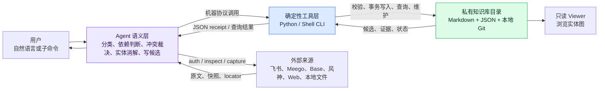

核心分工：

| 层 | 负责 | 不负责 |
|---|---|---|
| Agent 语义层 | 理解内容、决定摄取范围、判断冲突、选择节点、生成完整候选、解释结果 | 不手算 hash，不绕过事务直接宣称写入成功 |
| Python / Shell 工具层 | 授权检查、抓取、规范化、hash、幂等、schema 校验、原子写入、回滚、查询、修复 | 不理解业务语义，不决定“这是什么项目/决策” |
| 私有知识库 | 保存原文、出处、知识节点、用户状态、报告和本地回滚历史 | 不进入本 skill 仓库，不配置 remote |

## 1. 系统边界

### 1.1 三个物理区域

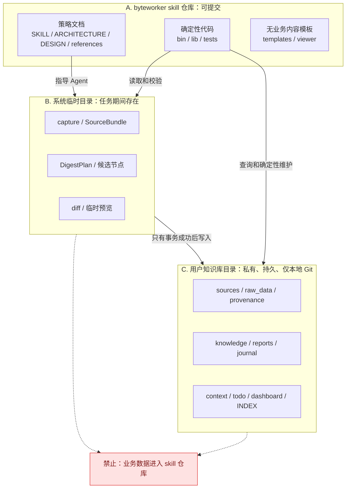

硬边界：

- skill 仓库只保存通用逻辑、文档、测试和无业务内容模板。
- capture、bundle、plan、候选节点可能含机密，必须放系统临时目录或知识库目录。
- 知识库目录是独立本地 Git 仓库，禁止配置 remote，禁止 push。
- 外部凭据只能来自环境变量、宿主授权存储或仓库外权限受限文件，不得进入任何 bundle、raw、
  provenance、日志或命令参数。

### 1.2 文档职责

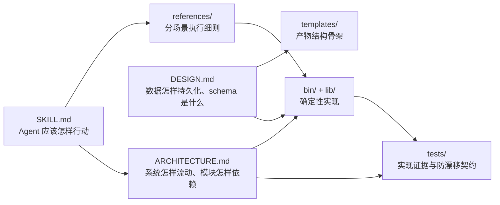

## 2. 整个 skill 的信息处理流程

### 2.1 每次调用的公共前置流程

所有业务子命令共享同一个准备阶段：

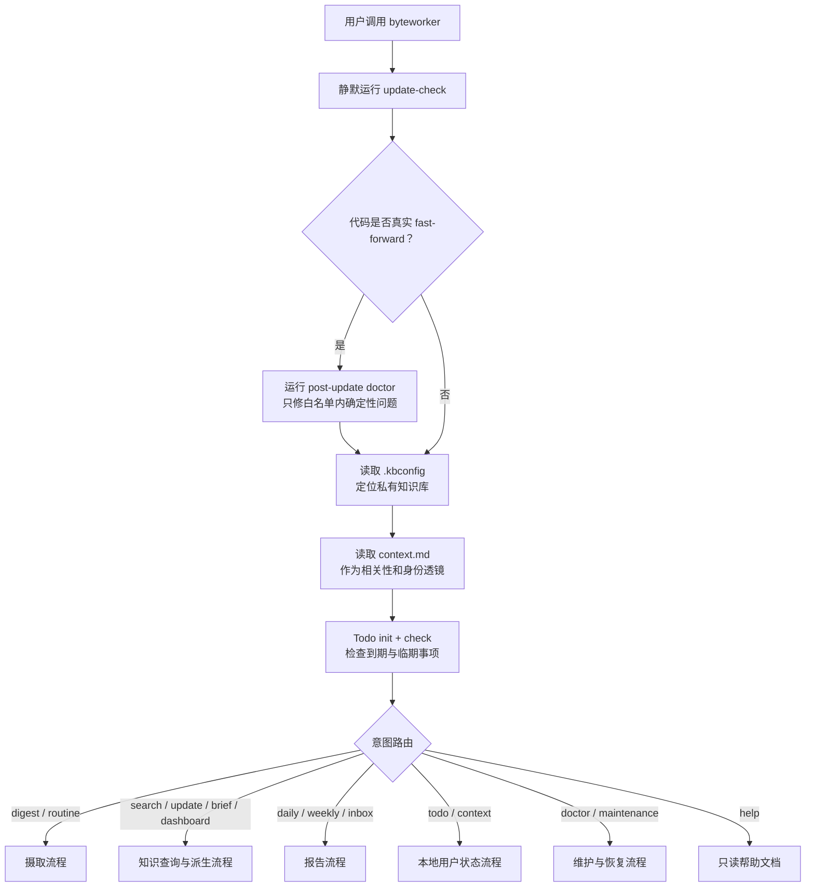

公共阶段的目的不是“加载所有数据”，而是建立本次工作的安全边界、用户语境和确定性入口。

### 2.2 单来源 digest 主流程

单来源的新标准是 `SourceBundle v2 + DigestPlan v2`：

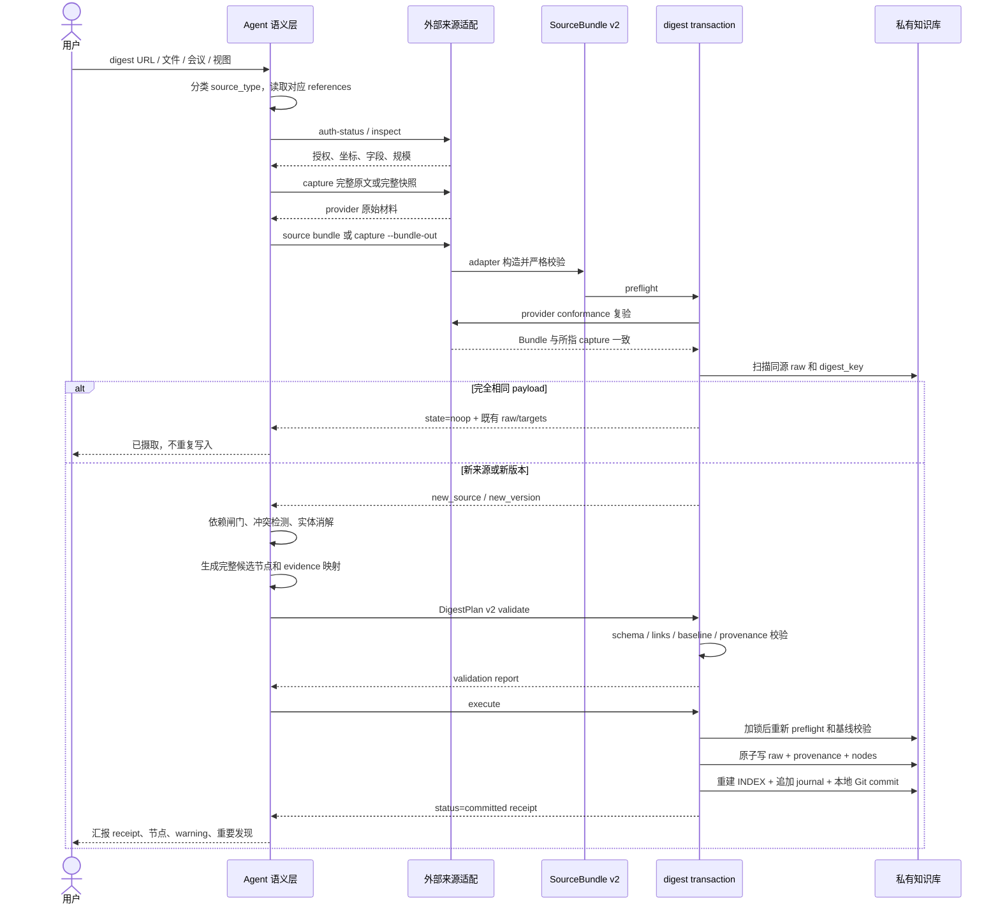

其中只有 Agent 做语义判断；事务层只接受完整、显式的结果：

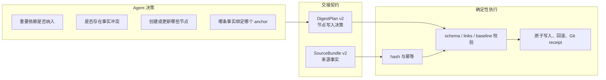

### 2.3 结构化来源的更新流程

Meego、Base、风神等大视图不把每一行变成知识节点：

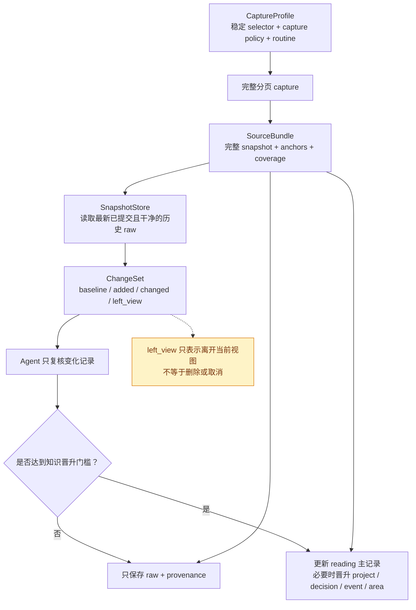

Meego 空间主页不是可持久化来源。operation adapter 只执行 `url decode` 判断 URL 类型，确认
`project_home / project_overview` 后立即以 `SOURCE_SELECTION_REQUIRED` fail closed，提示用户
提供包含 `/storyView/<view_id>` 的具体 Story View URL。该路径不触发 Auth Guard，不调用
`project search / view search / view get`，也不使用页面自动化。收到明确保存视图后，流程才进入
上图的 Profile / capture / Bundle。

### 2.4 查询与引用流程

查询不是让 Agent 盲扫整个知识库，而是先确定性召回，再回到原始证据：

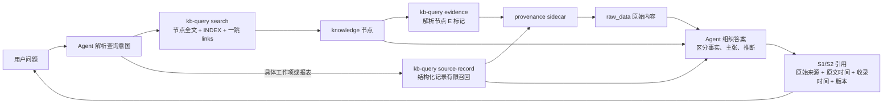

`record_index` 存在时，`source-record` 优先读取 provider-neutral 的
`byteworker-record-index/v1`；旧 raw 才通过兼容投影解析 Meego/Base/Aeolus 原始结构。

### 2.5 报告、Todo 与维护流程

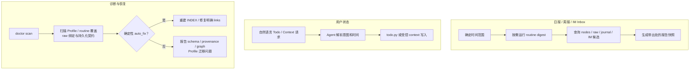

## 3. 数据生命周期

### 3.1 真相源与派生物

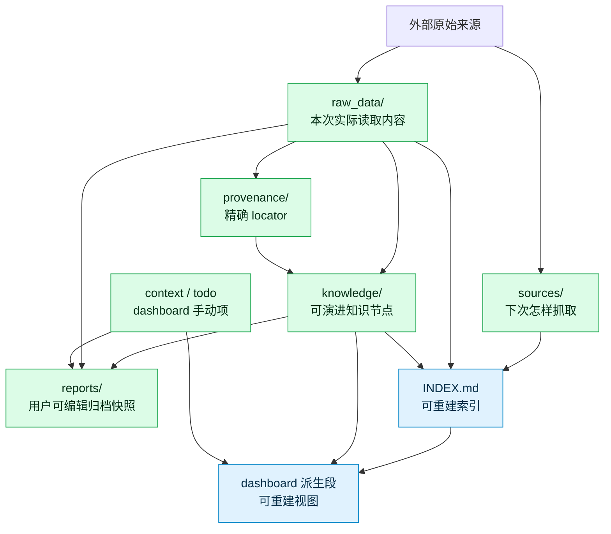

真相源损坏时不能靠 INDEX 反推修复；INDEX 或 dashboard 派生段不一致时，直接从真相源重建。

### 3.2 七类知识节点

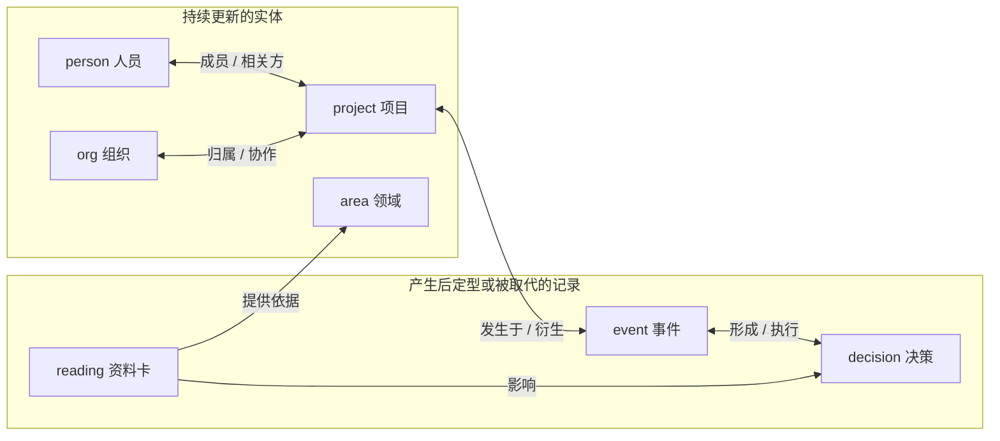

`person` 的实体消解与通讯录画像在 Agent 策略层和只读外部 helper 的边界完成：
`bin/resolve-users.sh --format json` 以来源中的精确 `open_id` 查询 lark-contact，返回版本化的
`byteworker-resolved-users/v1`；Agent 按 `feishu_id` 选择 person，并把同次查询的企业邮箱、
当前部门路径和核验时间写入完整候选。事务层只校验候选契约，不调用通讯录。部门路径是可变属性，
不是 provider-neutral org id；空结果不清除旧值，只有明确匹配已有 org 时才连边。

## 4. 代码层面的模块架构

### 4.1 分层与依赖方向

代码只允许从上层调用下层；底层不得反向依赖 Agent 策略：

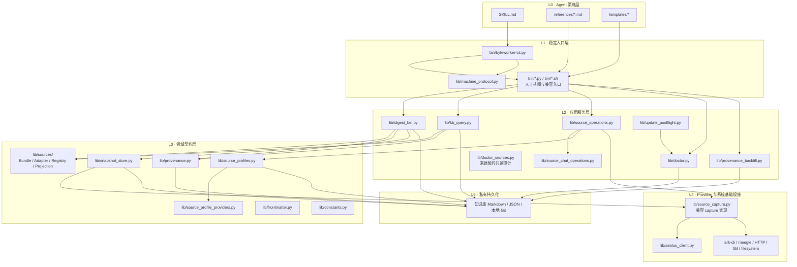

约束含义：

- `digest_txn.py` 和 `kb_query.py` 是 provider-neutral core，不得新增
  `if source_type == "..."`。
- provider 特例只能进入 source adapter、operation adapter 或明确标注的 legacy compatibility
  模块。
- `bin/source.py` 必须保持薄，只负责参数和 registry 分发。
- CLI 不承载业务语义；Agent 不复制确定性实现。

### 4.2 入口层

| 模块 | 职责 | 输出 |
|---|---|---|
| `bin/byteworker-cli.py` | 所有确定性工具的统一 facade；子进程调用直接 CLI | `byteworker-cli/v1` envelope |
| `lib/machine_protocol.py` | 构造 `status/data/error/context`，稳定 error code 和上下文 | 单行或 pretty JSON |
| `bin/digest-txn.py` | digest 的 preflight / validate / execute / snapshot-node | transaction report/receipt |
| `bin/source.py` | capabilities / auth / inspect / capture / bundle / profile / diff 参数入口 | capture、SourceBundle、profile receipt、ChangeSet |
| `bin/kb-query.py` | search / evidence / source-record | 有覆盖信息的有限候选 |
| `bin/doctor.py` | scan / fix | finding 与修复回执 |
| `bin/todo.py` | Todo 的确定性存储与时间操作 | Todo 状态 |
| `bin/resolve-users.sh` | 按 open_id 只读解析 person 身份与当前通讯录画像；默认 TSV 兼容旧调用 | `byteworker-resolved-users/v1` JSON 或兼容三列 TSV |
| 其它 `bin/*.sh` | 外部拉取、索引/links 重建、viewer、安装与更新辅助 | 明确的文件或 JSON/文本回执 |

机器协议只统一执行边界，不做插件发现，也不改变底层业务语义。

### 4.3 Source 子系统

Source 子系统允许 provider 内部异构，但交给事务层的边界必须统一：

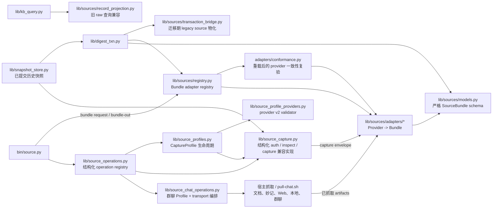

当前真实能力按三个正交集合声明，调用方通过 `source capabilities` 查询，不能把“已支持
Bundle”误认为“也必须有同形态网络 capture”：

| 能力 | 当前来源 | 边界 |
|---|---|---|
| operation | `meego`、`feishu_base`、`aeolus`、`feishu_chat` | 前三类提供结构化 auth/inspect/capture；群聊用 Profile 包装 `pull-chat.sh` 完整分页 |
| Profile | `meego`、`feishu_base`、`feishu_chat`、`feishu_doc`；兼容 `aeolus` v1 | Base/Chat/Doc/Meego 使用 v2；Aeolus 保留 v1 |
| Bundle adapter | `meego`、`feishu_base`、`aeolus`、`feishu_chat`、`feishu_doc`、`feishu_minutes`、`web`、`local_md` | 所有单来源统一输出 `SourceBundle v2` |

- Meego/Base/Aeolus 可用 `capture --bundle-out` 从完整 capture 同步产生 Bundle。
- Meego `inspect / capture` 对空间主页返回 `SOURCE_SELECTION_REQUIRED`，不生成 Bundle 或
  Profile，也不发起网络业务读取；用户提供具体 Story View URL 后才进入标准 inspect / capture。
- `capture --bundle-out` 必须先在内存中完成 Bundle 校验，再预检并暂存两个不同的输出路径；
  第二个替换失败时恢复第一个文件，且拒绝 `--out` 与 `--bundle-out` 指向同一路径。通用
  `bundle request` 只接受 `capture_path`，拒绝同时存在的内联 capture，避免两份内容真相。
- 群聊的 Profile capture 直接输出 Bundle，并把逐字稿和 locator artifact 保存在 Bundle
  旁的业务临时目录。
- 群聊 operation 单独位于 `lib/source_chat_operations.py`；它复用 `pull-chat.sh`，避免把
  高水位、transcript/locator 编排继续堆进结构化 `source_operations.py`。
- 飞书文档、妙记、Web 和本地文件由宿主能力先抓取原始 artifact，再用
  `source bundle --source-type ... --request ... --out ...` 进入同一边界。
- `feishu_meeting` 是日历、妙记、投屏文档组成的复合编排，不注册伪造的单来源 adapter；
  各物件先各自产生 Bundle，再由 meeting/batch 流程组合。
- `source_capture.py` 暂时是结构化来源兼容实现，不应继续吸收
  transaction/query/CLI 分支。

#### 4.3.1 最终领域模型

Source 子系统统一的是交接契约，不是 provider 的内容结构：

| 术语 | 最终定义 | 关键边界 |
|---|---|---|
| `SourceRef` | `source_type/source_uid/source_url/title/revision` 组成的稳定来源身份 | revision 可空；UID 不随一次抓取变化 |
| `CaptureProfile` | `selector/capture_policy/routine` 描述“下次怎样读” | 不保存凭据和抓取结果；显式修改产生新 revision |
| `SourceCapabilities` | adapter 对 component kind、coverage、稳定记录 ID、record index 和 diff 能力的真实声明 | `record_index` 或 incremental diff 必须以稳定记录 ID 为前提 |
| `SourceBundle` | 本次实际读到的 identity、components、coverage、anchors、provider metadata 和可选 record index | 是进入 digest 的唯一来源交接；不定义统一正文 AST |
| `SnapshotStore` | 从不可变 raw 中定位最新或显式历史的、已提交且完整的 snapshot | 返回 raw/path/ingested/source 等出处；坏 raw、身份不符、未提交 raw 均 fail closed |
| `ChangeSet` | baseline、added、changed、left_view 等有限变化集合 | `left_view` 只表示离开当前视图，不等于删除或取消 |
| `DigestPlan` | Agent 对节点、evidence、journal 和 commit 的完整写入决策 | v2 只引用 Bundle，不复制 source identity 或 anchors |

`SourceBundle.components` 保留 provider 自身形态：文档可以是 body/comments/whiteboard，
群聊和妙记是 transcript，Web/本地资料是 body，结构化来源是 canonical records snapshot。component 使用 `verbatim` 或
`canonical-json` 模式；不为了“统一”而把飞书文档、Meego、Base、风神压成同一个内容 AST。

通用 schema 校验只证明 envelope 合法，不证明字段仍然忠于 provider。Bundle 从磁盘重载并
进入事务前，registry 必须调用 adapter 的 `validate_bundle`：结构化来源从唯一的
`snapshot` component 重新构造期望 Bundle，并复验 identity、coordinates、coverage、
anchors、record index 和 `snapshot_hash`。事务派生的 `payload_hash` 单独由事务复算，不参与
provider 一致性比较。任何差异都必须在写 raw 之前 fail closed。

Hash 语义必须区分：

| Hash | 表示什么 | 用途 |
|---|---|---|
| component digest | 单个 component 规范字节的 SHA-256 | 独立判断正文、评论、白板或 records 是否变化 |
| `snapshot_hash` | 结构化 records snapshot 自身 | 结构化来源快速比较完整视图 |
| `payload_hash` / raw `content_hash` | 事务对全部 components 重算后的组合 hash | 同源版本判重与 Bundle 完整性复验 |
| `digest_key` | 来源身份与实际 payload 组合后的幂等键 | `noop/new_version/resume_failed` 判定 |

#### 4.3.2 Profile、快照与查询的最终规则

- v2 Profile 的公共生命周期由 `lib/source_profiles.py` 管理，当前覆盖 Meego、Base、
  群聊和飞书文档；provider validator 严格校验
  selector 和 capture policy；未知字段、未知 provider、凭据字段全部拒绝。
- Base/群聊等新增 provider 规则放在 `lib/source_profile_providers.py`，避免 Profile 的
  持久化、revision 和 Git 生命周期继续吸收 provider 分支。
- 群聊的一次性显式窗口与 routine 增量 Profile 分开：启用 routine 必须使用
  `since_last=true`；高水位来自已提交 raw，Profile 只保存策略和 overlap。
- routine 优先且只按已注册 Profile 重放配置；没有 Profile 的历史来源才允许兼容读取 raw 上的
  routine。已有 Profile 时禁止从最近 raw 猜测或拼接抓取参数。
- `SnapshotStore` 默认选择同一 `source_type + source_uid` 最新的已提交完整 raw，也支持
  `raw_id` 或历史序号显式选择；current capture 与 previous snapshot 必须身份一致。
- collection adapter 可生成
  `record_id/title/source_time/locator/fields` 的 `byteworker-record-index/v1`。
  查询优先使用这个 provider-neutral 投影，完整 provider payload 继续作为 raw component 保留。
- 旧 raw 没有 record index 时，仅由 `lib/sources/record_projection.py` 做 Meego/Base/Aeolus
  兼容投影；新增 provider 不得因此修改 `lib/kb_query.py`。
- 迁移期 legacy frontmatter/source 字段仅由 `lib/sources/transaction_bridge.py` 物化；
  provider 规则不得重新散回 transaction core。

### 4.4 Digest transaction

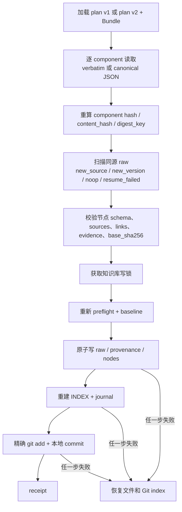

事务成功的唯一证明是 `status=committed` 和 commit hash。Agent 已生成候选、validate 成功或文件
看起来存在，都不等于事务完成。

### 4.5 查询与维护

| 模块 | 核心职责 | 允许写入 |
|---|---|---|
| `lib/kb_query.py` | 无持久数据库的节点召回、一跳扩展、evidence 和结构化记录查询 | 否 |
| `lib/provenance.py` | anchor schema、sidecar、节点 `[E]` 物化、raw 扫描 | 仅由事务调用 |
| `lib/provenance_backfill.py` | 历史出处 audit → plan → validate → apply | 仅显式 apply |
| `lib/doctor.py` | 编排布局、节点、raw、provenance、links、报告、INDEX 与来源契约扫描 | scan 否；fix 受白名单限制 |
| `lib/doctor_sources.py` | 只读检测 Profile/routine 覆盖、raw/Profile 绑定、payload component/digest key 与 record index 漂移 | 否 |
| `bin/rebuild_index.py` | 从真相源重建 INDEX | 是，可确定重建 |
| `bin/repair_links.py` | 修复明确、可证明的双向 links/autolink | 是，受保护 |
| `lib/update_postflight.py` | 代码真实更新后编排 doctor auto-fix | 是，仅确定性 finding |

## 5. 跨层契约

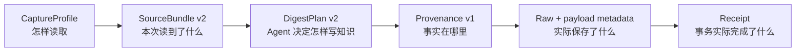

| 契约 | 所有者 | 关键不变量 |
|---|---|---|
| `byteworker-source-profile/v2` | `source_profiles.py` + 对应 adapter | 无凭据；selector 与 source UID 一致；revision 可重算 |
| `byteworker-source-bundle/v2` | `sources/models.py` | identity、components、coverage、anchors 唯一交接；业务路径不在 skill 仓库 |
| `digest-plan/v2` | Agent + `digest_txn.py` | 只引用 Bundle，不复制 source/anchors；节点候选必须完整 |
| `byteworker-provenance/v1` | `provenance.py` | anchor 可解析；绑定 raw content hash；关键事实 `[E]` 可回原文 |
| `byteworker-record-index/v1` | `sources/models.py` + collection adapter + transaction | provider-neutral 有限查询投影；原 provider snapshot 仍保留 |
| `byteworker-resolved-users/v1` | `bin/resolve-users.sh` | 精确 open_id 输入；身份失败不创建 person；部门为空不表示调动；`resolved_at` 带时区 |
| `byteworker-cli/v1` | `machine_protocol.py` | 稳定 `status/data/error/context`，不泄漏完整 argv 或正文 |
| transaction receipt | `digest_txn.py` | `committed/noop` 语义明确；写入和 commit 同成同败 |

doctor 不要求临时 `SourceBundle` 或 `DigestPlan` 在事务完成后继续存在，而是检查其落盘结果：
Profile schema/path、raw component 元数据和 digest key、Profile 绑定、record index、provenance
闭环。历史 routine 缺 Profile 按来源能力分级：Meego/Base/Aeolus/群聊缺失为 error，
飞书文档兼容 raw 但提示 warning；尚无 Profile schema 的来源才记兼容 info。任何 Profile 创建或迁移都
包含 selector/capture policy 的语义判断，因此不属于 `doctor fix` 或 post-update auto-fix。

## 6. 失败边界与安全策略

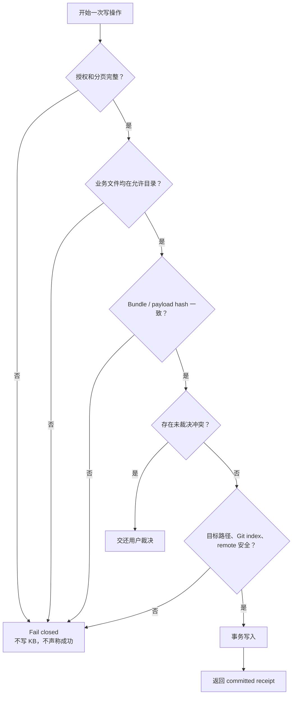

任何“不确定但继续写”的实现都违反本架构。权限不足、分页不完整、身份不一致、凭据污染、
hash 不一致、重复 ID、目标文件并发变化和 KB remote 都必须 fail closed。

## 7. 怎样扩展而不让架构失控

### 7.1 新增一种来源

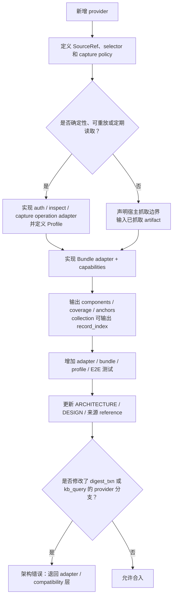

新增来源通常允许修改：

- `lib/source_operations.py` 或拆出的 provider operation adapter；
- `lib/sources/adapters/<provider>.py` 与 registry；
- `lib/source_profiles.py` 的 provider validator；
- 对应 `references/digest-<provider>.md`；
- tests 和本文件。

“统一”要求所有单来源最终进入 Bundle registry，但不要求所有来源拥有相同 transport：
结构化保存视图、群聊等确定性例行来源进入 operation/Profile；浏览器正文、妙记宿主产物等
先由宿主能力抓取，再由薄 adapter 校验。只有真实可重放的 selector/capture policy 才能写
Profile，不能为了矩阵好看而保存不可执行配置。

通常不允许修改：

- `lib/digest_txn.py` 来加入 provider 名称判断；
- `lib/kb_query.py` 来解析新的 provider 私有结构；
- `bin/source.py` 加一串新的 provider 条件分支。

### 7.2 新增命令或写流程

1. 先判断它属于 Agent 语义、确定性应用服务还是纯维护工具。
2. 确定性命令通过 `bin/byteworker-cli.py` 暴露统一 envelope。
3. 写知识节点必须复用 digest transaction；可重建派生物可使用独立原子维护工具。
4. 新的真相源字段或目录必须先修改 `DESIGN.md`。
5. 新的主流程或模块依赖必须同时修改本文件。

### 7.3 禁止的演进方式

- 在 skill 仓库生成带业务内容的一次性脚本、plan、capture 或候选节点。
- 因为某个 provider 特殊，就把特殊字段一路泄漏到 transaction、query 和 viewer。
- 绕过 Bundle，把多个不同 source manifest 结构直接交给 Agent 猜。
- 绕过 transaction 手工改 raw、provenance、知识节点、INDEX 和 journal，却仍声称原子完成。
- 用文档或最近 raw 猜一个已经有 profile 的结构化来源配置。
- 默认把结构化视图每一行变成实体节点。
- 查询时把整个大型 raw 交给 Agent，而不是使用 `source-record` 有限召回。
- 只修改代码不更新架构文档和契约测试。

## 8. 架构治理：每次开发必须执行

### 8.1 变更判断

以下任一项发生变化，都必须在同一个 commit 中更新本文件：

- 用户信息处理流程、失败路径或成功判定发生变化；
- 新增、删除、重命名 `bin/` 或 `lib/` 的核心模块；
- 模块职责、依赖方向或 provider 边界发生变化；
- SourceBundle、Profile、DigestPlan、Provenance、record index 或机器协议发生变化；
- 真相源、派生物、知识库目录或写入事务发生变化；
- 新增一种来源、新命令或新的持久化流程。

仅修改文案、CSS、单个模板展示且不影响上述边界时，可以不改架构图，但仍需确认本文件未失真。

### 8.2 Definition of Done

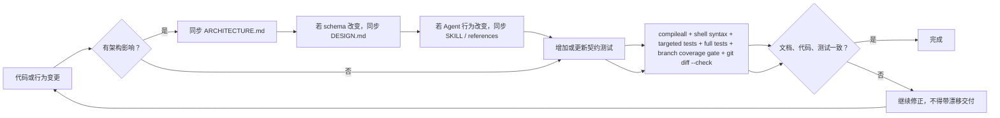

coding agent 在修改代码前应先阅读本文件相关章节；完成后必须在交付说明中明确：

- 是否改变架构；
- 更新了哪些架构图或为何不需要更新；
- 哪些测试证明实现与文档一致；
- 是否保留兼容层或新增技术债务。

覆盖率由根目录 `.coveragerc` 统一定义：统计 `bin/`、`lib/` 的 Python line/branch coverage，
并通过 coverage.py 的 `subprocess` patch 合并 CLI 子进程数据。CI 固定安装 Node.js 与 `jq`，
执行 viewer runtime、shell 行为与 Python 测试，最后用 `coverage report` 应用最低门禁；
测试不得仅靠 mock 覆盖入口而跳过真实命令形态和退出码。

### 8.3 当前兼容边界和已知债务

这些是**有意保留的真实实现**，不能误删，也不能伪装成已经完成迁移：

| 兼容项 | 当前原因 | 删除条件 |
|---|---|---|
| `digest-plan/v1` | 旧单来源调用仍需读取 | 连续版本无 v1-only 调用且用户结束兼容窗口 |
| `digest-batch-plan/v1` | 多来源 batch 尚无 v2 | 设计并验证 batch v2 后迁移 |
| Aeolus Profile v1 | 已部署 profile 使用旧结构 | doctor 可识别且真实旧 KB 验证通过 |
| `lib/source_capture.py` 单文件 | 保持旧 import 和成熟 capture 测试 | provider operation/transport 拆分完成且旧入口有兼容 facade |
| `transaction_bridge.py` | 为旧 raw/frontmatter 物化 provider 字段 | 新 raw/query 不再依赖 legacy 字段 |
| `record_projection.py` | 查询旧 Meego/Base/Aeolus snapshot | 兼容窗口结束或旧 raw 不再需要查询 |
| `resolve-users.sh` 默认三列 TSV | 已有人工/Agent 调用可能按 `open_id/姓名/feishu_id` 消费 | 调用方全部切到 `--format json` 且用户同意结束兼容窗口 |

任何兼容项的删除还必须同时满足：

1. 连续发布版本中没有只支持旧契约的调用；
2. doctor 能识别旧 raw/profile，且不要求破坏性全库迁移；
3. 旧格式 fixture 和真实旧 KB 的只读验证都通过；
4. 用户明确同意结束兼容窗口。

### 8.4 架构验证矩阵

架构修改不能只验证“新路径能跑”，还要证明 provider 隔离、旧数据读取和失败边界没有退化：

| 层 | 最低验证范围 |
|---|---|
| Adapter / operation | auth、inspect、capture、完整分页、顺序稳定、URL 脱敏、稳定 ID |
| Bundle | schema、credential/path 防护、component、anchor、coverage、canonical hash、重载后的 provider 派生一致性 |
| Profile | v1/v2 兼容、revision、unknown field、credential rejection |
| SnapshotStore | latest/history、坏 raw fail closed、source mismatch、baseline/diff |
| Transaction | plan v1/v2、no-op、新版本、rollback、并发、provenance、raw rendering |
| Query | canonical record index、legacy fallback、latest/history、exact anchor |
| Doctor | Profile v1/v2、routine 覆盖、raw/Profile identity、record index、legacy severity、postflight blocker |
| End-to-end | 结构化 capture → Bundle、群聊 Profile → Bundle、宿主 artifact → Bundle，以及 Bundle → commit → query/diff 闭环 |

`tests/test_architecture_contract.py` 固化文档入口和核心模块清单；
`tests/test_source_architecture.py` 固化 core 不含 provider 分支以及本节最终契约。

## 9. 目录导航

```text
byteworker/
├── ARCHITECTURE.md       # 本文件：流程和模块边界
├── SKILL.md              # Agent 行为入口
├── DESIGN.md             # 持久化 schema 与数据不变量
├── AGENTS.md             # coding agent 仓库铁律
├── references/           # 按场景加载的执行细则
├── templates/            # 节点、报告、plan、bundle 骨架
├── bin/                  # CLI facade、直接入口和 shell 集成
├── lib/                  # 确定性 Python 实现
│   ├── doctor_sources.py # Profile/routine/raw 来源契约只读审计
│   ├── source_chat_operations.py # 群聊 Profile capture 与高水位 transport 编排
│   ├── source_profile_providers.py # v2 provider selector/capture-policy 校验
│   └── sources/          # SourceBundle、adapter、provider conformance、registry、兼容投影
├── viewer/               # 纯前端只读知识库浏览器
└── tests/                # 单元、集成和架构防漂移契约
```

阅读建议：

1. 第一次理解项目：先读本文件第 0、2、4 节。
2. 修改 Agent 行为：再读 `SKILL.md` 和对应 `references/`。
3. 修改数据结构：再读 `DESIGN.md`。
4. 修改 Source：再读本文件第 4.3、7.1 节和 Source 重构账本。
5. 修改事务或查询：先确认没有把 provider 特例带回 core。
