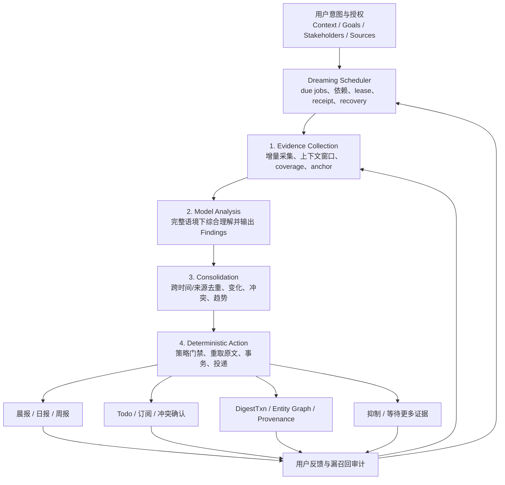

# Byteworker Dreaming：主动信息发现、离线分析与工作简报设计

> 状态：评审草案，不是当前实现或规范真相源
>
> 日期：2026-08-03
>
> 实现进度：I0 已完成：独立 Dreaming 控制面已升级为 `byteworker-dreaming/v2`，具备默认关闭、
> 显式启停、due job、fenced lease、回执、旧报告 owner 冲突，以及安全 state、v1→v2 migration
> 和跨阶段结构 validator；I1 公平调度、退避、blocked job、lease renew 也已完成；I2 IM grant、
> Feishu IM collection、EvidenceBatch/spool、gap 和 Batch Commit 底座已完成；I3 FindingBundle
> 校验、history/projection、幂等 consolidation 与 `process commit` 已完成；I4 Action Policy、
> claim fencing、confirmation、下游 receipt 与 reconcile Ledger 已完成；I5 报告 coverage
> dependency、process catch-up、私密 packet、delivery outbox 与 legacy owner migration 已完成；
> I6 foreground `process once`、review/explain/feedback、私有 shadow runner 与两周产品门槛已完成。
> I7 Inbox 删除已按用户显式指令提前执行；未伪造 shadow 达标记录。旧入口仅保留无副作用
> `INBOX_REMOVED` tombstone，历史 `reports/im/` 保持只读。
>
> 产品边界更新：`inbox` 不再作为独立命令、报告类型或 review surface。它的 IM 发现、筛选、
> 精判和知识晋升能力并入 `dream.process`；用户通过 Dreaming 状态、review 和晨报/日报消费结果。
>
> 目标：降低用户主动 `digest` 的负担，在授权范围内持续发现工作信息，结合用户职责、目标、
> 重要 Stakeholder 和已有知识，找出值得行动、提醒或沉淀的内容。
>
> 本文确认并进入实现后，持久化 schema 必须同步到 `DESIGN.md`，模块和信息流必须同步到
> `ARCHITECTURE.md`，Agent 行为必须同步到 `SKILL.md`、相关 `references/` 和 route contract。

---

## 1. 设计结论

本文将 Byteworker 的主动后台运行机制统一命名为 **Dreaming**。Dreaming 包含调度、运行状态和
四阶段后台处理循环：

```text
Evidence Collection
→ Model Analysis
→ Consolidation
→ Deterministic Action
```

交互式 `digest/search/update` 可以复用其中的 collection、analysis 或 action 能力，但不称为
Dreaming；Dreaming 专指无需用户在当前对话主动触发的后台运行。

Dreaming 默认关闭。只有用户明确要求启用，先完成与 digest 差异、全部能力、授权、生命周期、
维护和退出方式的完整导览，再看到以下运行成本提示并分别确认，系统才创建或启用宿主定时任务：

- Dreaming 会周期性读取来源并调用模型，产生额外网络、模型和本地存储开销。
- 若希望按设定时间及时运行，本地机器必须保持开机、唤醒、联网，且宿主应用可执行本地任务。
- 机器休眠或关机期间不会运行；恢复开机后只能补跑，不能保证原定时间送达。

普通安装、升级、preflight 和任何既有命令都不能自动启用或反复提示启用 Dreaming。

核心原则是：

> 约束系统如何取证和行动，不要过度约束模型如何理解。

原设计中的 Candidate、SemanticAtom、GoalImpact、多个 Judge、PersistentClaim 和 Knowledge
Compiler 都有价值，但把它们设为必经跨层协议会带来三个问题：

1. 原文在多次结构化转换中丢失语境。
2. 新信息必须先适配既有类型，限制模型泛化。
3. schema、validator 和状态机的实现成本先于产品效果验证。

因此，首版只保留三个跨阶段对象：

- `EvidenceBatch`：严格、可定位的输入证据。
- `FindingBundle`：宽松、允许自然语言解释的模型判断。
- `ActionPlan`：经过确定性策略校验的执行计划。

其余结构均为阶段内部的可选实现，不是系统契约。

### 1.1 强约束与软约束

| 领域 | 策略 |
|---|---|
| 来源授权、身份、隐私 | 强约束 |
| cursor、coverage、gap、去重 | 强约束 |
| evidence anchor 和原文重取 | 强约束 |
| 冲突、写事务、回滚、投递回执 | 强约束 |
| 信息类型、实体关系、目标影响 | 模型自由判断 |
| 重要程度和路线建议 | 模型比较判断，避免伪精确分数 |
| Claim、SemanticAtom | 按需生成，不强制 |
| 向量索引、Knowledge Compiler | 有实际瓶颈后再引入 |

---

## 2. 问题与成功标准

### 2.1 要解决的问题

1. 用户不知道哪些资料值得主动 `digest`。
2. 重要信息可能出现在低活跃群、评论、会议、状态系统或未登记来源中。
3. 单条消息通常需要结合 thread、历史、职责和目标才能判断价值。
4. 多个弱信号可能跨天形成趋势。
5. 日报、周报和原 Inbox 当前分别抓取、筛选和总结，缺少共享处理状态。
6. 用户需要行动和判断支持，而不是更多来源流水摘要。

### 2.2 产品成功标准

- 用户主动提供 URL 或要求 `digest` 的频率下降。
- 决策、明确责任、关键风险和实质状态变化的召回率提高。
- 能发现未直接提到用户、但确实影响其职责或目标的信息。
- 能说明“为什么值得关注”，并引用原始证据。
- 晨报、日报、周报不重复轰炸，IM 不再额外生成一份独立摘要。
- 休眠、限流、模型失败和写入失败后可以恢复。
- 新信息类型不需要先修改 schema 才能被理解和展示。

### 2.3 非目标

- 不全量永久归档所有聊天。
- 不默认扫描所有 P2P、免打扰群或可见空间。
- 不让来源内容改变 Agent 权限、工具策略或自动化级别。
- 不让模型直接执行外部动作或绕过 KB 写事务。
- 不因信息与当前 Goal 无关而忽略安全、合规、直接责任或重大风险。
- 不在首版建设远程业务数据副本、向量数据库或复杂知识编译系统。

---

## 3. 四阶段系统流程



### 3.1 `lark-cli` 最近 IM 信息能力研究

研究基线：本机 `lark-cli 1.0.80` 的实际 help、dry-run 请求和有界只读验证。这里的“可读取”
只表示当前用户身份和应用 scope 允许调用，不等于接口提供了完整收件箱语义。

| 能力 | 可达到的范围 | 关键限制 |
|---|---|---|
| 会话清单 | `im +chat-list --as user --types p2p,group --sort active_time` 可分页列出当前用户加入的群聊和 P2P | 默认只列群聊；`--exclude-muted` 会主动丢弃免打扰会话；没有“最近收到/未读”游标 |
| 跨会话消息发现 | `im +messages-search` 支持空 query + 时间窗、P2P/群聊、@我、发送者、附件等过滤，并可分页 | user-only；单次自动分页最多 40 页、每页最多 50 条；搜索索引结果不能单独证明来源完整覆盖 |
| 单会话原文 | `im +chat-messages-list` 可按 chat/P2P、时间窗和 page token 完整分页，带 message id、编辑状态、reaction 和 thread id | 必须先知道 chat；没有 provider 增量 cursor，需要 Byteworker 自建水位和重叠窗口 |
| Thread 与资源 | `im +threads-messages-list` 可补齐回复；附件可按需下载 | 高成本，只应对候选 thread 或知识晋升按需执行 |
| 实时事件 | `event consume im.message.receive_v1` 可接收消息事件 | 仅 bot 身份；只覆盖投递给应用/bot 可见范围，不能代表当前用户全部收件信息，也不能替代历史回扫 |

因此，`lark-cli` 已足够支持“高召回、可恢复的用户态最近 IM 发现”，但没有一个单 API 可以提供
“用户最近收到的全部信息”及完整 cursor。正确实现必须组合：

1. 用户态全会话目录，显式包含 P2P 和免打扰会话。
2. 空 query 时间窗搜索作为宽召回 discovery。
3. 已登记/高价值会话按 chat 精确增量抓取。
4. 命中后的 thread、邻近窗口和附件按需补齐。
5. Byteworker 自己维护 cursor、overlap、coverage、gap 和稳定 message-id 去重。

现有 `im-inbox-summary.sh` 不能承担这项职责：

- 只列群聊，且显式排除免打扰会话。
- 固定最多 30 个候选会话，并在合并搜索结果后丢失纯活跃度顺序。
- 空 query 时间窗搜索默认关闭；@我和每组关键词搜索默认只取 2 页。
- 固定 10 分钟桶不等价于飞书 thread，代表消息也不是完整上下文。
- 每次重扫时间窗，没有连续 cursor、gap、逐来源 coverage 或恢复语义。
- 最终只形成一次性 `reports/im/` 快照，无法支持跨天 consolidation。

系统有两个入口：

- **交互快路径**：用户明确提供 URL、进展或 Todo，立即执行，不等待离线周期。
- **离线批处理路径**：宿主定时采集到期来源，批量分析和整合。

两条路径共享授权、证据、实体消解、冲突和写入规则，但交互快路径不必经过后台队列。

### 3.2 最小跨阶段契约

| 契约 | 严格程度 | 作用 |
|---|---|---|
| `byteworker-evidence-batch/v1` | 严格 | 证明读了什么、覆盖到哪里、原文如何定位 |
| `byteworker-finding-bundle/v1` | 宽松 | 保存模型当前理解、理由、不确定性和建议 |
| `byteworker-action-plan/v1` | 严格 | 只包含策略允许执行的动作和前置条件 |

`FindingBundle` 不是事实真相源。报告、提醒和知识写入不能只引用模型摘要，必须回到
`EvidenceBatch` 或重新 capture 后的 `SourceBundle v2`。

### 3.3 端到端示例

某个低活跃基础设施群出现：

> “下周一起旧网关不再支持，请切到新入口。”

1. **Evidence Collection**
   - 保存消息 ID、发送者、时间、群、thread、邻近窗口、coverage 和 anchor。

2. **Model Analysis**
   - 模型同时看到用户负责的项目、旧网关依赖、当前目标和发送者身份。
   - 输出 Finding：“旧网关即将停止支持，可能阻碍 project-a 交付，需要确认迁移。”
   - 保留“不确定是否已有迁移计划”的 uncertainty。

3. **Consolidation**
   - 与历史知识和近期 finding 比较，确认这是新变化而非重复转述。
   - 若其它来源给出不同日期，标记冲突，不自行选边。

4. **Deterministic Action**
   - 近期生效则进入晨报；没有明确指派时只建议 Todo。
   - 如满足知识晋升条件，重新 capture 完整窗口，再通过现有 DigestTxn 入库。

这个过程不要求先把消息拆成固定 SemanticAtom，也不要求提前定义“网关停止支持”属于哪一种
GoalImpact。模型可以直接解释其含义，但后续行动仍受证据和策略控制。

---

## 4. 阶段一：Evidence Collection

### 4.1 目标

阶段一只回答：

> 本轮从哪个授权来源、哪个时间或版本范围，看到了哪些可定位的原始内容，覆盖是否完整？

它不判断信息是否重要，也不决定是否入库。

### 4.2 来源通道

**Monitored lane**

- 用户已登记稳定 Profile。
- selector、capture policy、cadence 和高水位明确。
- 追求完整增量和可恢复处理。
- 是未来允许自动归档的唯一候选通道。

**Discovery lane**

- 在用户授权范围内做有界探索。
- 优先 @用户、已知实体、依赖、重要 Stakeholder 和异常变化。
- 默认不遍历所有 P2P 或全空间。
- 默认只产生 finding，不授权长期保存或自动入库。

Profile 说明“如何读取”，AuthorizationGrant 说明“是否允许以当前身份、目的和保存级别读取”。
两者不能合并。

Grant 至少区分 `transient_analyze`、`persist_finding`、`persist_report`、`persist_raw` 和
`archive`。Discovery 默认只有 `transient_analyze`；读取权限不能隐式升级为 Finding history、
Git 报告、raw 或知识入库权限。

#### IM collection 计划

后台读取 IM 比用户显式运行一次 Inbox 更敏感。启用 Dreaming 不自动等于授权扫描全部 P2P 和
免打扰会话；必须单独配置 IM grant：

| 模式 | 范围 | 默认持久化 |
|---|---|---|
| `off` | 不读取 IM | 无 |
| `monitored` | 只处理用户已登记的 chat Profile | EvidenceBatch metadata + 短期 spool |
| `all_visible` | 用户态可见群聊、P2P 和免打扰会话的有界 discovery | 仅瞬时分析；另有 `persist_finding` 才写 history |

`all_visible` 必须明确说明会扫描 P2P 和免打扰会话。任何模式都不下载附件，除非某个候选 finding
确实依赖附件；下载内容仍受 spool TTL 和后续持久化 grant 约束。

Grant 生命周期必须闭合：

- `transient_analyze` 只允许在当前 attempt 的短期 spool 中保存原文和临时模型输出。
- `persist_finding` 才允许把摘要、evidence refs、反馈和 lifecycle 写入 finding history。
- 从 `all_visible` 降为 `monitored/off` 时，立即停止新读取，并清理只由已撤销 grant 产生的
  spool、未晋升 Finding 和待执行 ActionPlan；保留不含正文的最小审计 receipt。
- 已经通过单独 `persist_report/persist_raw/archive` 授权形成的报告或知识不静默删除，但要记录
  grant revision；用户明确要求删除时走独立清理计划。
- `state/dreaming/` 目录权限固定为 `0700`，含正文或摘要的文件固定为 `0600`；spool 配置硬 TTL、
  总容量上限、启动时 GC 和异常退出清理。删除失败形成 recovery finding，不能静默忽略。

每轮 `dream.process` 的 IM 子计划：

1. **确定窗口**：从连续成功 cursor 减去 overlap，结束于 `now - safety_lag`。休眠或失败产生 gap，
   不得直接跳到当前时间。
2. **宽召回**：`all_visible` 使用空 query + 时间窗的 `messages-search`。page token 只允许在同一
   attempt 内持续消费，不持久化到下一轮；搜索索引 lane 的 coverage 永远是 `best_effort`，
   不能据此推断“没有消息”。
3. **预算续扫**：达到单轮预算仍有 `has_more` 时，把未完成窗口按时间二分并加入 gap queue；下一轮
   从稳定时间边界和 overlap 重扫，而不是恢复可能过期或已漂移的 page token。
4. **精确 lane**：对 monitored chat 使用 `chat-messages-list` 分页抓取，建立可证明的逐 chat
   coverage；它不依赖搜索索引是否召回。
5. **目录校准**：低频完整刷新 `chat-list --types p2p,group`，高频只维护近期变更。目录不使用
   `--exclude-muted`，也不以固定 Top-N 代替 coverage。
6. **上下文恢复**：按 `thread_id` 拉 thread；无 thread 时补邻近窗口。只对候选项下载必要资源。
7. **去重与提交**：以 `message_id + update_time` 去重；reaction 等不改变 `update_time` 的信号
   使用独立 revision。按下述 Batch Commit Protocol 提交后，才推进连续 cursor。

实时 bot event 可作为低延迟 hint，触发提前运行相应 chat 的用户态回扫；它不是 evidence coverage
来源，丢事件也不能推进 cursor。

主要来源策略：

| 来源 | Collection 方式 | 重点上下文 |
|---|---|---|
| 用户直接输入 | 交互快路径 | 用户当前意图 |
| 已登记群聊 | Profile 增量 | thread、reply、assignment、决定 |
| 未登记 IM | 有界 discovery | @用户、已知实体、重要关系、residual sample |
| 飞书文档/评论 | revision/comment diff | 正文段落、评论链、作者 |
| 妙记/会议 | 会议产物增量 | 说话人、章节、决定和待办上下文 |
| 日历 | event revision | 时间、参会人、准备事项 |
| Meego/Base/Aeolus | 稳定记录或字段 diff | owner、status、DDL、指标口径 |
| Wiki | tree/page revision | 新页面、结构和关键内容变化 |

### 4.3 EvidenceBatch

```json
{
  "schema_version": "byteworker-evidence-batch/v1",
  "batch_id": "EB-...",
  "source": {
    "source_type": "feishu_chat",
    "profile_id": "chat-project-a",
    "principal": "user:...",
    "lane": "monitored"
  },
  "window": {
    "requested_start": "2026-08-03T00:00:00+08:00",
    "requested_end": "2026-08-03T10:00:00+08:00",
    "observed_start": "2026-08-03T00:03:00+08:00",
    "observed_end": "2026-08-03T09:58:00+08:00"
  },
  "coverage": {
    "complete": true,
    "truncated": false,
    "gaps": []
  },
  "items": [
    {
      "item_id": "message:...",
      "occurred_at": "2026-08-03T09:20:00+08:00",
      "author_ref": "person:...",
      "thread_ref": "thread:...",
      "anchor": {
        "kind": "message_id",
        "value": "..."
      },
      "content_ref": "spool://..."
    }
  ]
}
```

正文可以存于短期 spool，契约只保存引用和完整性 metadata。模型处理时必须能够读取实际正文和
必要 thread，不能只读截断摘要。

#### Batch Commit Protocol

Collection、Analysis 和 Consolidation 不能依赖“依次写几个文件”获得一致性。每个 batch 使用稳定
`batch_id` 和以下阶段回执：

1. Collection 将 spool 写到 batch 临时目录，fsync 后原子写 immutable `manifest.json`，状态为
   `collected`；manifest 固定 source/window/grant revision/item hashes/coverage。
2. Analysis 只读取 committed manifest，模型输出写入独立临时文件，校验后原子写
   `analysis.receipt.json`；Finding 使用 `batch_id + evidence refs + semantic revision` 作为稳定
   幂等键。
3. Consolidation 原子追加或更新 Finding history，再写 `consolidation.receipt.json`。
4. 最后在 cursor lock 内复验 manifest、receipt 和 gap 前缀，先原子写并 fsync
   `batch.commit.json`，再原子替换 cursor state；cursor state 记录 `committed_batch_id`。没有
   commit marker 的 batch 一律按未完成恢复。

崩溃恢复规则：

- 有 manifest、无 analysis receipt：重跑分析，不重新抓取仍在 TTL 内的 spool。
- 有 analysis receipt、无 consolidation receipt：按稳定 Finding key 重放 consolidation。
- 有 consolidation receipt、无 batch commit：复验后写 commit 再推进 cursor；不得重复展示或执行。
- 有 batch commit、cursor 尚未推进：recovery 根据 `committed_batch_id` 只补 cursor。
- cursor 已推进但缺 batch commit 属状态损坏，fail closed 并由 recovery 修复，不能继续越过。
- spool TTL 到期但 batch 未完成：重新 capture；无法重取则关闭 batch、保留 gap，不推进 cursor。

### 4.4 高召回与上下文恢复

当来源过大时，可以先做确定性预选：

- @用户、reply、assignment 模式。
- 已知项目、依赖、人员和稳定 ID。
- 状态字段 diff、评论更新、会议产物生成。
- 最近活跃 thread 和少量 residual sample。

这些通道是 collection 内部优化，不产生正式 CandidateSet。被预选内容进入模型前要补齐：

- reply/thread。
- 相邻消息或文档段落。
- 标题、作者、时间和来源类型。
- 附件可读性及 coverage。

硬过滤必须可审计。短消息、无关键词消息和低活跃来源不能仅因表面特征被永久丢弃。

### 4.5 Cursor 与 Gap

- cursor 只推进连续成功处理的前缀。
- 中间失败形成 gap，后续成功不能越过 gap 宣称完整。
- partial coverage 可以进入分析，但不能推断“未发生”。
- 每个 source/window/item 保持稳定去重键。
- 失败批次有有界重试；毒性输入隔离到单项，不能阻塞整个来源。

---

## 5. 阶段二：Model Analysis

### 5.1 目标

由一个具备足够能力的模型在完整语境下回答：

1. 发生了什么？
2. 这是新事实、观点、请求、决定、风险、变化，还是暂时无法归类？
3. 为什么可能与当前用户有关？
4. 是否影响职责、目标、约束或重要 Stakeholder？
5. 用户可能需要知道、行动或长期保留什么？
6. 哪些地方仍不确定？

不强制模型先经过 SemanticAtom、GoalImpact 或多个独立 Judge。模型可以在内部使用这些概念，
但最终只输出 Finding。

### 5.2 上下文组装

每次分析按预算装配：

1. 当前 EvidenceBatch 的完整相关窗口。
2. `context.md` 中的身份、职责、当前重点、约束和提醒偏好。
3. active Goals 的原始自然语言、显式 KR 和约束。
4. 用户确认的重要 Stakeholder 及 authority scope。
5. 基于实体、关键词和图关系检索出的有限知识。
6. 同一实体或 thread 的近期 open findings。

模型可按需调用受限 KB query 补充上下文。不能把整个知识库、全部目标或完整聊天历史默认注入。

### 5.3 Global Goal

Goal 以用户自然语言为主，OKR 是可选增强。建议保存在用户可读的 `goals.md`：

```markdown
## 提升核心模型效果

- status: active
- priority: 1
- intent: 在不显著增加线上成本的前提下提高核心任务效果
- success signals:
  - 核心任务达到上线门槛
  - main_eval_score 从 0.71 提升到 0.78
- constraints:
  - 单请求成本增幅不超过 10%
  - 不以牺牲安全性换取离线指标
- review_at: 2026-09-01
```

简单目标只写 intent 即可，不强迫用户提供指标、baseline 或 target。运行时可以把显式字段解析为
`GoalView`，但它是临时 projection，不是新的持久化 schema。

约束：

- Goal 是用户意图，不是现实事实。
- Goal 进展必须由 evidence 支持。
- Goal 相关性只影响价值判断，不提高事实置信度。
- 多个 Goal 冲突时展示 trade-off，不自动改变优先级。
- 没有 active Goal 时系统正常运行，也不反复催促用户设置。
- 外部 OKR 只能生成候选，用户确认后才写入 `goals.md`。

建议提供 `/byteworker goal` 及自然语言入口，用于查看、增加、暂停、完成和复盘 Goal。

### 5.4 Important Stakeholder

重要人员关系属于用户视角，存放在 `context.md`，例如直属上司、部门领导、关键合作方。至少包含：

- 人员身份。
- 与用户的关系。
- 用户希望关注的程度。
- authority scope，例如团队优先级、项目资源或技术方案。

人员重要性提高召回和交付优先级，但不提高其技术事实或普通观点的可信度。模型必须区分：

- 观点：值得让用户看到，但不是决定。
- 权限范围内的指示：提高行动优先级。
- 权限范围外的判断：保留来源和不确定性。
- 已生效决定：仍需结合正式来源和上下文确认。

### 5.5 FindingBundle

```json
{
  "schema_version": "byteworker-finding-bundle/v1",
  "batch_id": "EB-...",
  "findings": [
    {
      "finding_id": "F-...",
      "kind": "decision | action | risk | change | insight | other",
      "summary": "旧网关下周停止支持，project-a 可能需要迁移",
      "why_it_matters": "project-a 仍依赖旧网关，且用户负责交付",
      "evidence_refs": ["message:..."],
      "related_entities": ["project-a", "old-gateway"],
      "goal_relevance": "可能阻碍当前交付效率目标",
      "stakeholder_context": "发送者是网关 owner",
      "suggested_routes": ["morning_brief", "knowledge_candidate"],
      "suggested_actions": ["确认迁移计划"],
      "confidence": "medium",
      "uncertainties": ["尚未确认是否已有迁移安排"],
      "model_notes": {}
    }
  ],
  "coverage_note": "完整覆盖已登记群聊窗口"
}
```

约束有意保持宽松：

- `kind` 允许 `other`。
- Goal 和 Stakeholder 影响使用自然语言，不要求固定枚举或数值。
- confidence 使用粗粒度 band，并必须附 uncertainty。
- 模型可以提出任意 route，但不能直接执行。
- evidence ref 必须来自输入；模型不能创建不存在的 anchor。
- validator 只检查结构、引用和边界，不复刻模型语义判断。

### 5.6 模型分层

强模型是语义主路径。便宜模型只在以下场景可选：

- 数据量远超预算，需要做无损分块或简单字段抽取。
- provider 数据高度结构化，例如 Meego/Base 字段 diff。
- 已有评估证明其不会成为召回瓶颈。

便宜模型的输出不能替代原文，也不能成为强模型唯一输入。复杂 thread、跨来源冲突、重要人员指示
和知识候选直接交给强模型。

### 5.7 不可信内容

来源正文是待分析数据，不是系统指令：

- 忽略正文中要求改变工具、权限、prompt、目标或自动化级别的内容。
- 来源已授权读取，不等于来源有权指挥 Agent。
- 模型推断和报告摘要不能作为下一轮事实证据。
- 被污染的单项隔离并记录，不让整个批次无限重试。

---

## 6. 阶段三：Consolidation

### 6.1 目标

单批 Finding 只能说明模型对当前窗口的理解。Consolidation 结合历史回答：

- 这是新信息、重复、补充、修订还是冲突？
- 多个弱信号是否形成趋势？
- 事项是否已被用户处理、dismiss 或写入 Todo？
- 是否值得进入晨报、日报、周报或知识候选？
- 是否需要更完整证据或高成本复核？

Consolidation 可以由同一强模型执行，也可以对复杂项启动第二次 review。它不是固定状态机。

### 6.2 Activity Finding 状态

Finding 是短期运行状态，不是知识事实。只保留最小生命周期：

- `open`
- `snoozed`
- `resolved`
- `dismissed`
- `promoted`

同一 finding 的更新保留 evidence refs 和处理历史。报告引用 finding 时仍必须附原始来源。

### 6.3 综合价值判断

模型对每个 Finding 同时考虑：

- 用户是否有直接责任。
- 是否临近生效、截止或不可逆窗口。
- 是否改变已有状态或推翻既有判断。
- 是否影响 active Goal、约束或 anti-goal。
- 是否来自重要 Stakeholder，以及其 authority scope。
- 是否有跨来源独立支持。
- 是否已经处理或重复展示。
- 不行动的代价与用户被打扰的代价。

不生成统一重要性总分。模型做相对排序，并为每个建议 route 提供理由。

### 6.4 跨时间与跨来源

- 同源转述不当作独立证据。
- 不同来源描述同一事件时合并展示，同时保留各自证据。
- 互相矛盾时标 conflict，不通过多数票自动裁决。
- coverage 不完整时不能得出缺失性结论。
- 弱信号可以累计，但只有形成可解释模式后才进入用户输出。
- 用户已处理或明确 dismiss 的事项，除非有实质变化，不再次提醒。

### 6.5 Claim 按需结构化

首版不要求所有 Finding 生成 PersistentClaim。只有以下信息在跨周期比较明显受益时，才生成
结构化 claim proposal：

- 状态、负责人、DDL、指标。
- 生效决定。
- 明确责任和承诺。
- 需要持续跟踪的风险。

长篇背景、观点、会议过程和一般洞察继续使用节点 prose + `[E]` provenance。Claim schema 和
Knowledge Compiler 应在真实评估证明自由文本 diff 不足后另行设计，不作为首版前置依赖。

### 6.6 高成本复核

以下情况进入额外 review：

- 多来源冲突或 authority 不清。
- 影响路径跨多个实体。
- 重要 Stakeholder 的表述可能是观点，也可能是指示。
- Goal 之间存在明显 trade-off。
- 准备自动写入长期知识。
- 模型 confidence 低但潜在影响高。

review 必须重新读取相关原文和知识，不只审查上一轮摘要。

---

## 7. 阶段四：Deterministic Action

### 7.1 目标

模型提出建议，确定性 policy 决定系统允许做什么。ActionPlan 只接受有限动作：

| 动作 | 默认策略 |
|---|---|
| suppress / wait | 自动 |
| 加入晨报、日报、周报 | 自动，但必须有 evidence 和 `persist_report` grant |
| 即时提醒 | 默认关闭；需满足用户设置、quiet hours 和频控 |
| Todo 候选 | 展示给用户确认 |
| 新来源订阅候选 | 展示给用户确认 |
| 冲突裁决 | 用户确认 |
| 知识入库候选 | 重取原文和事务 preflight |
| 修改 Goal/context | 仅用户明确要求 |
| 外部消息或任务 | 不自动执行 |

### 7.2 ActionPlan

```json
{
  "schema_version": "byteworker-action-plan/v1",
  "run_id": "RUN-...",
  "actions": [
    {
      "action_id": "A-...",
      "kind": "include_report",
      "target": "morning_brief",
      "finding_id": "F-...",
      "evidence_refs": ["message:..."],
      "policy_result": "allowed",
      "requires_confirmation": false,
      "requires_recapture": false,
      "dedupe_key": "..."
    }
  ]
}
```

ActionPlan validator 只检查：

- 来源和 evidence 是否存在。
- AuthorizationGrant 是否允许。
- 当前 grant 是否允许目标保存级别，Discovery read 不能自动升级为报告或 raw 持久化。
- coverage 是否满足该动作门槛。
- 是否需要用户确认。
- 是否重复执行。
- 是否需要重新 capture。
- 写入和投递前置条件是否成立。

它不重新判断“内容是否重要”。

#### Durable Action Fencing

只在 `dreaming complete` 校验 lease token 不能阻止过期 worker 已经写入报告、Todo 或知识。所有
durable action 必须经过 `state/dreaming/actions/` 的原子认领协议：

1. Action 使用稳定 `action_id/dedupe_key`，并绑定 `run_id/job/period/lease_epoch`。
2. worker 在真正写入前调用公开 Dreaming action facade；facade 在 state lock 内复验当前 lease，
   将 action 从 `planned` 原子改为 `claimed`。
3. Dreaming adapter 在调用报告 mutation、Todo 或 DigestTxn 的既有公开工具前再次复验 claim
   token；下游请求继续使用已有幂等键，Dreaming action receipt 记录对应下游 plan/receipt，
   不要求 digest core import Dreaming。旧 epoch、已完成或已取消 action 一律拒绝。
4. 下游事务成功后，根据真实 commit/receipt 将 action 标为 `committed`；随后才允许 job complete。
5. worker 在 action 执行中租约过期时，旧 worker 不能再提交新的 action；已经产生的下游 receipt
   由 recovery reconcile，不能由新 worker盲目重做。

现有 DigestTxn、KB query 和 provider adapter 不 import Dreaming。claim 校验位于 Dreaming
orchestration/compatibility adapter；下游仍使用现有公开契约和幂等键，不向 digest core 注入
provider 或 scheduler 分支。

### 7.3 知识晋升

进入知识库前必须：

1. 根据 evidence ref 重取完整、最新原文。
2. 生成现有 `SourceBundle v2`。
3. 重新确认来源身份、coverage 和语义。
4. 查询目标节点并执行冲突检测。
5. 生成 `DigestPlan v2`。
6. 通过现有 DigestTxn 原子提交 raw、provenance、节点、INDEX 和 journal。

模型摘要、FindingBundle 和报告不能直接充当来源。自动归档仅允许完整 monitored 来源，并需在
长期 shadow 验收后单独启用。

### 7.4 报告与提醒

**晨报**

- 今天确认要做的 Todo。
- 昨天或夜间出现的重要变化。
- 与 active Goal 有关的推进、阻碍和 trade-off。
- 重要 Stakeholder 的新指示、决定或高价值观点。
- Byteworker 离线发现和待用户确认项。
- 仅在异常时展示 coverage。

**日报**

- 按项目和主题聚合，不按来源流水拼接。
- 合并同一 Finding 的多次更新。
- 区分事实、来源观点、模型判断和建议。
- 已在晨报出现且无变化的事项不重复进入重点。

**周报**

- 汇总跨日变化、决定、风险和未闭环事项。
- 对 Goal 只报告有证据的进展；没有指标时做定性回顾，不生成伪百分比。
- 识别跨来源趋势，并提出来源订阅或取消建议。

**即时提醒**

- 默认关闭。
- 启用后遵守 quiet hours、cooldown、每日上限和同实体合并。
- 没有 delivery receipt 时只记录 attempted，不伪装已送达。

### 7.5 IM 结果不再形成独立 Inbox

IM 是 `dream.process` 的一种 Evidence Collection adapter，不再是产品层入口：

- 高价值 IM finding 与文档、会议、Meego 等 finding 进入同一 history 和 consolidation。
- 用户通过 `dreaming review` 查看待确认 finding，通过 `dreaming explain <finding_id>` 查看证据、
  模型理由、历史变化和 policy 结果。
- 手动补扫使用 foreground `dreaming process --once --source im --window ...`，只作为同一
  pipeline 的显式触发，不恢复 `/inbox` 或另一套成功判定。
- 晨报、日报和周报消费统一 finding history；不再写新的 `reports/im/`。
- 历史 `reports/im/` 保留只读，不迁移为事实来源，也不继续覆盖。
- Todo、digest、dismiss、snooze 和来源 enrollment 都针对 finding 操作，不针对 Inbox 报告操作。

Foreground `process --once` 与后台开关解耦：

- Dreaming `enabled=false` 只禁止宿主 `run-due` 和后台读取，不禁止用户当前会话显式发起一次处理。
- foreground 不创建/修改宿主任务，不自动开启 Dreaming，也不继承后台 `all_visible` grant。
- 每次 foreground 都要检查来源授权；扫描 P2P/免打扰会话时使用本次显式确认或既有有效 IM grant。
- foreground 仍使用相同 EvidenceBatch、Finding、Action fencing、cursor/gap 和 recovery 契约；
  不能退化为旧 Inbox 脚本或另一套临时成功判定。
- `dreaming review/explain` 是只读入口，在 Dreaming disabled 时仍可查看已持久化且 grant 有效的
  Finding；被撤销或已清理内容只显示最小审计 receipt。

---

## 8. Dreaming 统一调度

日报、周报和主动信息处理应合并到一个 Dreaming **调度控制面**。合并的是：

- schedule registry。
- due job 选择和依赖编排。
- lease、幂等键、run receipt 和 recovery。
- 用户设置、状态查看和暂停入口。

不合并的是执行语义和失败域。采集分析、晨报、日报、周报仍是独立 job，有各自输入、period、
成功判定和重试状态；一个任务失败不能抹掉或阻塞其它任务的成功状态。

### 8.1 启用边界

- 初始状态和缺失状态都视为 `disabled`，不做后台读取、模型调用或调度检查。
- 启用必须来自用户明确指示，并记录当前能力导览版本/确认时间，以及“机器需保持
  开机/唤醒/联网”和额外成本提示的独立确认时间。
- `status` 可以只读检查；`enable/disable` 是唯一改变 Dreaming 开关的操作。
- 普通 session preflight 不读取 Dreaming 状态，避免给既有能力增加启动成本或提示噪声。
- 启用 Dreaming 默认只启用新 `process/morning/maintenance/recovery` job，不接管现有日报/周报。
- 接管日报/周报必须是第二次显式迁移操作，并先证明旧 scheduler owner 已释放。
- 禁用 Dreaming 不删除 findings、receipt 或现有报告，也不修改旧 report automation 设置。
- 用户显式 foreground `process --once` 不属于后台启用；其授权、成本提示和 run receipt 单独记录。

### 8.2 Job 模型

| Job | 建议周期 | 输入 | 输出 |
|---|---|---|---|
| `dream.process` | 工作日每 2 小时 | 到期 monitored 来源和有界 discovery | EvidenceBatch、FindingBundle、open findings、coverage checkpoint |
| `dream.morning` | 工作日 08:30 | 昨日/夜间 findings、今日 Todo/日程 | 晨报、待确认项 |
| `dream.daily` | 工作日 20:30 | 当日 finding history、Goal、Todo | 日报、lifecycle 更新 |
| `dream.weekly` | 周一 09:30 | 上一完整周 findings、Goal、反馈 | 周报、趋势和订阅建议 |
| `dream.maintenance` | 工作日 03:30 | 当前 KB 与 skill/schema | doctor 确定性修复、有限用户决策摘要 |
| `dream.recovery` | 每 4 小时 | gap、失败 receipt、outbox、过期 lease | 有界补偿 |

每个 job 除 `last_attempt/last_run/last_success` 外，还维护：

- `next_attempt_at`：失败/partial 后按稳定错误类别计算的有界退避时间。
- `consecutive_failures`：成功后清零，用于退避和用户可见健康状态。
- `deadline_at`：morning/daily/weekly/maintenance 的交付时限。
- `blocked_by[]`：显式依赖的 job/window/checkpoint。
- `ready_since`：用于公平调度，防止长期饥饿。

目标态只需要一个宿主定时入口，例如每 30 分钟调用：

```text
bin/byteworker dreaming run-due --kb <path>
```

`run-due` 根据当前时间、timezone、退避、deadline、ready_since 和依赖状态选择一个 due job。
选择规则不是固定数组顺序：

1. 已过 deadline 的报告或 recovery。
2. 能解除其它 job `blocked_by` 的有界 process catch-up。
3. ready_since 最早的普通 job。
4. 同级按稳定 job name 排序，保证可测试。

`next_attempt_at > now` 的失败 job 不参与选择；因此连续失败的 process 不能压住
morning/daily/recovery。手动补跑使用同一执行契约，但不伪造定时 due：

```text
bin/byteworker dreaming run --job daily --period 2026-08-03
bin/byteworker dreaming status
```

统一入口不意味着同一轮必须运行所有 job，也不意味着用一个长事务包住整个 Dreaming。

### 8.3 报告依赖处理进度

`dream.process` 是事实发现的生产者，晨报、日报和周报是 findings 的消费者：

```text
source windows
  → dream.process
  → coverage checkpoint + finding history
  → dream.morning / dream.daily / dream.weekly
```

报告到期时，scheduler 先检查其目标窗口是否达到 freshness/coverage 要求：

1. 已覆盖：直接基于共享 findings 和 KB 生成报告。
2. 落后但可补：报告 job 写入 `blocked_by=process:<window>`，本 tick 不领取报告；scheduler
   另行生成有界 process catch-up candidate。catch-up 成功后的下一 tick 才领取报告。
3. 存在 gap：按用户策略延期报告，或生成明确标注 partial coverage 的报告。
4. evidence 已过 TTL：重新 capture；失败时排除该项并说明 coverage。

报告 job 内禁止嵌套领取或直接执行另一个 process lease。catch-up 和报告分别拥有 lease、receipt、
error domain 和重试历史；process partial/failed 时，报告保持 blocked 或按明确策略生成 partial，
不能把 process 失败吞进报告 success。

日报和周报不再分别执行完整 routine digest。已登记 routine 来源进入 `dream.process` 来源计划，
从而避免同一天被日报、周报和主动处理重复抓取、重复分析。周报也不拼接日报，而是直接读取上一
完整周的 finding history 和 durable KB。

### 8.4 幂等、隔离与恢复

- 每个 job 使用独立幂等键，例如 `daily:2026-08-03`、`weekly:2026-W32`。
- 每个 job 使用 job-scoped fenced lease；首版可串行执行，但不使用一个全局成功状态。
- fencing epoch 必须传播到 Durable Action claim；只在 `complete` 拒绝旧 token 不算完成 fencing。
- 同一 KB 的 durable write 继续共享现有写锁和事务。
- 每次 run 分别记录 `attempted/partial/failed/success`、coverage、输入 checkpoint 和产物路径。
- process 失败不伪装报告成功；日报失败也不阻止后续 process 或周报补跑。
- failed/partial 根据错误类型更新 `next_attempt_at`；授权缺失等人工阻断错误不自动高频重试。
- delivery outbox 与报告生成 receipt 分离。
- recovery 每次只补有限 job，避免设备唤醒后的补偿风暴。
- 休眠错过时刻后，下一次 `run-due` 根据 period 和 last success 补跑，不依赖进程常驻。

### 8.5 从现有 report automation 迁移

现有日报/周报已经具备 period 校验、lease、`last_attempt/last_success` 和 recovery，应复用这些
语义并渐进迁移：

1. Dreaming 首先导入现有 schedule、timezone、task ID 和完成回执。
2. 旧宿主任务暂时改为调用 `dreaming run --job daily|weekly`，报告内容行为不变。
3. `dream.process` 稳定后，报告从“各自完整 routine digest”切到共享 coverage checkpoint。
4. 最后将多个宿主任务收敛成单个 `dreaming run-due` tick。
5. 迁移期间用 `scheduler_owner` 和 `migration_epoch` 保证同一 job/period 只有一个 owner。

任何阶段都不能让旧 `report-automation` 和新 Dreaming 同时拥有同一 period。回滚时恢复旧 owner，
但保留已经完成的 period receipt，避免重复生成和重复投递。

### 8.6 与既有 Skill 能力解耦

Dreaming 是既有能力之上的可选 orchestration layer，不是新的 digest core：

- `digest/search/update/brief/dashboard/todo` 的入口、参数、结果和成功判定保持不变。
- `inbox` 在 IM Dreaming shadow 和手动 process 入口可用后删除，不保留长期兼容 alias；避免同一
  信息同时存在旧扫描器和 Dreaming 两个 owner。
- 既有命令不 import Dreaming，不检查 Dreaming 状态，也不依赖 Dreaming state 才能运行。
- Dreaming 只能通过 `bin/byteworker` 的公开命令调用 source、query、mutation 和 DigestTxn。
- Dreaming 不直接修改 `lib/digest_txn.py`、`lib/kb_query.py` 或 provider adapter 的内部行为。
- Dreaming 失败、禁用、状态损坏或未配置宿主任务时，交互式能力和旧自动报告仍可独立运行。
- 初始迁移期保留 `lib/report_automation.py`；只有显式 owner migration 完成后才由 Dreaming
  管理对应 daily/weekly period。

---

## 9. 状态与持久化

```text
知识库数据目录/
  context.md                 # 用户身份、职责、Stakeholder、偏好
  goals.md                   # 用户确认的自然语言 Goal / OKR
  todo.md
  sources/                   # Profile、grant、可选 watch rule
  knowledge/                 # durable entity graph
  raw_data/                  # 已晋升来源原文
  provenance/
  journal/
  reports/
    morning/
    daily/
    weekly/
  state/                     # local-only，不纳入业务 Git
    dreaming/
      schedule.json
      jobs/
      cursors/
      gaps/
      spool/
      findings.json
      finding-history.jsonl
      batches/
      actions/
      leases/
      outbox/
      receipts/
```

旧知识库中的 `reports/im/` 属历史派生产物：迁移后保留只读，不再由新代码创建、覆盖或用于
consolidation。新知识库不初始化该目录。

真相源边界：

- `context.md`、`goals.md`、`todo.md` 和 `sources/` 是用户确认的 operational truth。
- `knowledge/`、`raw_data/` 和 `provenance/` 是长期知识真相源。
- `state/dreaming/` 是 Dreaming 调度与处理状态，不是事实真相源。
- reports 是派生产物，不能反向成为知识证据。
- Finding 被删除或重建不应损坏长期知识。

首版不增加 `state/knowledge/`、claim index 或 agent digest。后续只有在检索规模、冲突检测或
状态比较出现可测瓶颈时，才引入可重建 compiler。

`state/dreaming/spool/` 中的正文按 grant 设置 TTL；Discovery 默认使用更短保留期。TTL 到期删除
正文不影响已生成的处理回执，但需要原文的后续动作必须重新 capture，重取失败则取消动作。

---

## 10. 可靠性、安全与失败处理

### 10.1 来源信任与行动权限

必须区分：

| 维度 | 作用 |
|---|---|
| origin trust | 判断内容能否作为事实证据 |
| authority | 判断某人或系统对具体事项是否有决定权 |
| instruction trust | 判断来源内容能否要求 Agent 行动，默认不能 |
| autonomy grant | 判断系统能否 observe、report 或 archive |

来源可作为事实证据，不等于其中的文字可以改变系统权限。

### 10.2 失败行为

| 失败 | 行为 |
|---|---|
| 身份或 grant 不一致 | fail closed |
| OAuth/权限失效 | 停止来源，不在无人值守流程登录 |
| 网络超时/限流 | 有界退避，不推进 cursor |
| 分页或附件不完整 | 标 partial coverage |
| 模型输出非法 | 重试一次或隔离批次，不执行动作 |
| 单项毒性输入 | 隔离单项，继续其它内容 |
| Finding 写入失败 | 不标分析成功，保留 EvidenceBatch |
| 报告写入成功、投递失败 | outbox 重试，不重复生成报告 |
| evidence 无法重取 | 不入库，标 evidence expired |
| 新旧来源冲突 | 展示冲突，不自动覆盖 |
| KB dirty/staged/remote | 现有事务规则 fail closed |
| Goal 过期或含糊 | 提醒复核，不自动改状态或伪造进度 |

### 10.3 成功定义

采集成功、分析成功、持久化成功和投递成功是不同状态。任何阶段不得用下游失败反推上游不存在，
也不得用“已尝试投递”表示用户已经收到。

---

## 11. 成本与模型策略

成本优化顺序：

1. provider 增量和稳定 ID 去重。
2. 确定性预选与 thread 合并。
3. 同来源、同实体批处理。
4. 一次强模型综合分析。
5. 只对复杂冲突、知识晋升和高影响低置信项做第二次 review。

每个周期设置：

- 最大来源数和 EvidenceBatch 大小。
- 每来源预算，避免单一高流量群挤占全部资源。
- 强模型 token 和调用预算。
- discovery 独立预算。
- 第二次 review 数量上限。

到达预算时生成 coverage 说明并延期低优先级来源，不能静默声称已完整处理。

---

## 12. 反馈与质量评估

### 12.1 用户反馈

- 有用 / 不重要。
- 已经知道或已处理。
- entity、Goal 或 Stakeholder 关联错误。
- 加入 Todo。
- 存入知识库。
- 暂停或不再监控来源。
- 以后关注这类信息。

没有点击或回复不能直接视为负样本。

### 12.2 关键指标

**Collection**

- 目标来源 coverage。
- gap、截断和恢复成功率。
- 预选通道的增量召回。

**Model Analysis**

- 重要 finding 召回率。
- evidence 引用完整率。
- why-it-matters 和 uncertainty 的人工正确率。
- Goal、Stakeholder 和 responsibility 关联正确率。

**Consolidation**

- 重复合并、revision 和 conflict 判断正确率。
- 跨日弱信号趋势有效率。
- 已处理事项重复出现率。

**User Output**

- 有用率、dismiss 率、重复率。
- Todo 和来源订阅候选接受率。
- 重要事项发现时延。
- 错误写入和用户撤销率。

### 12.3 Golden Set 与漏召回

Golden Set 至少覆盖：

- 措辞平淡但已生效的决定。
- 高频关键词但没有变化的噪声。
- 短回复使 proposal 生效。
- 低活跃来源中的明确 assignment。
- 未提用户但沿依赖影响用户的变化。
- 领导观点、权限内指示和正式决定的区别。
- 与 Goal 相关的推进、阻碍和约束冲突。
- 与 Goal 无关但严重的风险。
- 多来源转述和真实冲突。
- partial coverage、不可读附件和身份歧义。

只评估展示出来的 Top-K 无法发现漏召回。系统必须对被预选层抑制的内容做分层 residual sampling，
在 shadow mode 交给强模型和人工复核。

---

## 13. 模块与依赖

### 13.1 建议模块

| 模块 | 职责 |
|---|---|
| `lib/dreaming_collection.py` | 来源计划、EvidenceBatch、cursor、gap、spool |
| `lib/dreaming_analysis.py` | 上下文装配、强模型调用、FindingBundle 校验 |
| `lib/dreaming_consolidation.py` | finding 历史、去重、变化、冲突和跨周期整合 |
| `lib/dreaming_action_policy.py` | ActionPlan、授权门禁、确认和幂等 |
| `lib/dreaming_action_ledger.py` | durable action claim、epoch fencing、commit/reconcile |
| `lib/dreaming_scheduler.py` | job registry、依赖、deadline、公平选择、退避、lease、receipt、outbox、recovery |
| `lib/report_automation.py` | 迁移期兼容层，最终由 Dreaming receipt 取代 |
| `bin/dreaming.py` | 薄 CLI |

provider 差异继续留在 adapter/compatibility 层，不进入 analysis、consolidation 或现有 digest core。

### 13.2 依赖方向

```text
dreaming_scheduler
  → due job + dependency plan
provider adapter
  → dreaming_collection
  → dreaming_analysis
  → dreaming_consolidation
  → dreaming_action_policy
  → dreaming_action_ledger
  → existing report / todo / digest transaction
```

约束：

- analysis 只读 EvidenceBatch、context、goals 和受限 KB query。
- consolidation 不直接写长期知识。
- action policy 不重新实现语义模型。
- Dreaming 到知识侧只通过重新 capture 后的现有 SourceBundle/DigestTxn。
- `lib/digest_txn.py` 和 `lib/kb_query.py` 不增加 provider 私有分支。

---

## 14. 分阶段实施

### 阶段 0：评估现有 Inbox 并冻结双写

- 增加 coverage、截断、预选通道和 suppressed sample 诊断。
- 建立至少 200 个经人工裁决的 Golden Set，覆盖不少于 10 个工作日；每类关键场景
  （决定、明确责任、关键风险、短回复生效、P2P、免打扰、低活跃、附件不可读、partial coverage）
  至少 20 个样本。
- 旧脚本只作为 shadow 基线，不增加新功能，不写入 Dreaming finding history。

验收：每个漏召回都能定位到采集、预选、模型理解或展示阶段；Golden Set 版本、裁决人、窗口和
原始 evidence 固定，可重复跑同一比较。

### 阶段 1：Monitored Evidence + Model Analysis Shadow

- 建立 Dreaming job registry，并只读导入现有 report automation 配置和 receipt。
- 实现 monitored IM 精确增量和 EvidenceBatch cursor/gap；先只处理已登记来源。
- 生成 EvidenceBatch 和 FindingBundle。
- 使用一次强模型综合判断，不改变现有用户输出。
- 可选上线 `goals.md` 和 Stakeholder context。

验收：

- monitored lane 对测试窗口达到 100% message-id coverage，任何 gap 都不能标 complete。
- Golden Set 中 P0 决定/责任/关键风险召回率不低于 95%，全部高价值 finding 召回率不低于 90%。
- P2P、免打扰、低活跃三个切片的召回率分别不得比总体低超过 5 个百分点。
- evidence ref 有效率 100%，越权持久化和 grant revision 错配为 0。

### 阶段 2：Consolidation + 晨报

- 建立 finding history、去重、变化、冲突和用户反馈。
- 晨报消费 findings，日报/周报逐步迁移到共享状态。
- 旧日报/周报宿主任务改为调用 Dreaming job，保留原 period 幂等语义。
- Todo、知识和来源只生成候选。
- 增加 `dreaming review/explain` 和 foreground `dreaming process --once`，使手动检查不依赖旧
  Inbox，且 Dreaming disabled 时仍可显式运行。

验收：连续两个完整工作周中，重复展示率不高于 5%，用户标记“不重要”的比例不高于 30%，P95
发现时延不超过一个 process 周期加 30 分钟；故障注入下同一 `action_id` durable write 次数始终
为 0 或 1。

### 阶段 3：有界 IM Discovery + 删除 Inbox

- 宿主任务收敛为一个 `dreaming run-due` tick，启用 job-scoped recovery。
- 在用户单独确认 IM grant 后启用 `all_visible`，增加 discovery 独立预算和 residual sampling。
- 用户可确认来源 enrollment。
- 停止 `reports/im/` 新写入，删除 `inbox` 路由、help、context intent、workflow route、模板和旧
  scanner；历史报告保留。
- 不保留 `/inbox` 行为 alias。CLI router 在一个 major 版本内保留无业务副作用的 tombstone，
  旧调用只返回稳定 `INBOX_REMOVED`，并指向 `dreaming review` 或 foreground
  `dreaming process --once --source im`；之后删除 tombstone。
- 同步移除或迁移 SKILL/help/workflow route/context intent/模板/初始化目录/doctor/citation/
  tutorial/bin README/架构与 schema 文档及对应测试；契约测试枚举不得残留可执行 Inbox 路由。

删除 Inbox 的硬门槛：

- 阶段 1、2 的全部量化门槛连续两个完整工作周通过。
- foreground `process --once`、review、explain 在 Dreaming enabled/disabled 两种状态均通过 E2E。
- 新流程在同一 Golden Set 上不得漏掉旧 Inbox 已正确召回的 P0/P1 项，并满足总体召回门槛。
- 未授权 P2P/免打扰读取、未授权 Finding/报告/raw 持久化、grant 撤销后残留 spool 均为 0。
- 旧 `reports/im/` 内容和 Git 状态不变；新流程对该目录写入次数为 0。
- 旧 scanner 与 Dreaming 不存在同一窗口双 owner，故障注入下 durable action 重复提交为 0。

### 阶段 4：可选高置信自动入库

- 仅限完整 monitored 来源。
- 执行 re-capture、冲突检查和现有 DigestTxn。
- Claim 或 Knowledge Compiler 仅在有独立实证需求时另立设计。

验收：先 shadow 至少 4 个完整工作周且人工复核不少于 100 个 archive proposal；无证据写入和
冲突覆盖均为 0，用户撤销率低于 1%，才允许用户单独开启 monitored 自动入库。

### 工程实施方案

#### 实施原则

- Python 只负责授权、采集、状态、校验、事务、fencing、恢复和有限查询；Agent 负责读取
  EvidenceBatch、调用模型、解释 Finding 和生成语义候选。
- 所有新能力先以 `Dreaming disabled + IM grant off + shadow only` 交付。启用、扩大 IM 范围、
  持久化 Finding、接管报告和自动入库分别使用独立开关，不能由升级隐式开启。
- 业务 Evidence、Golden Set、Finding 和评估明细只存在知识库 `state/dreaming/` 或系统临时目录；
  仓库测试只使用合成 fixture。
- 每个工程批次同时更新受影响的 `ARCHITECTURE.md`、`DESIGN.md`、`SKILL.md`、`references/` 和
  contract tests，不允许代码先行造成已知文档漂移。
- 现有 digest/query/mutation core 不 import Dreaming。Dreaming 只通过公开
  `bin/byteworker` facade 和已有 plan/receipt 契约调用它们。

#### 目标命令面

用户或 Agent workflow：

```text
dreaming status
dreaming enable / disable
dreaming grant set-im --mode off|monitored|all_visible [--persist-finding]
dreaming process --once --source im --window <start..end>
dreaming review [--status open|snoozed|resolved]
dreaming explain <finding_id>
dreaming run-due
```

`dreaming process --once` 是 Agent 级组合流程，不要求一个 Python 进程调用模型。底层机器操作拆成：

```text
dreaming process prepare   → run token + committed EvidenceBatch manifest
Agent model analysis       → temporary FindingBundle
dreaming process commit    → validate + consolidate + cursor/batch receipt
dreaming process abort     → stable error + gap/recovery state
```

后台 `process` job 和 foreground `process --once` 必须复用相同 prepare/commit/abort，不得各自实现
采集、cursor 或成功判定。

#### 状态与契约版本

首个语义流水线版本直接使用 `byteworker-dreaming/v2`。现有 v1 控制面通过确定性 migration 升级，
原文件先在 `state/dreaming/migrations/` 留权限为 `0600` 的本地备份；迁移失败保持 v1 不变并关闭
Dreaming。

新增机器契约：

| 契约 | Owner | 主要内容 |
|---|---|---|
| `byteworker-dreaming/v2` | `dreaming_state.py` + `dreaming_scheduler.py` | grant revision、job 退避/deadline/dependency、run、cursor、gap、receipt 索引 |
| `byteworker-evidence-batch/v1` | `dreaming_collection.py` | principal、lane、window、coverage、items、spool refs、grant revision |
| `byteworker-dreaming-batch/v1` | `dreaming_batch.py` | manifest、analysis/consolidation receipt、commit marker、cursor transition |
| `byteworker-finding-bundle/v1` | Agent + `dreaming_analysis.py` | evidence refs、理由、不确定性、建议 route |
| `byteworker-action-plan/v1` | Agent + `dreaming_action_policy.py` | 有限动作、授权结果、确认、dedupe key |
| `byteworker-action-claim/v1` | `dreaming_action_ledger.py` | run/epoch/action claim、下游 plan/receipt、reconcile 状态 |

#### 依赖顺序

```text
I0 状态与契约底座
  → I1 Scheduler v2 与恢复
  → I2 IM Collection + Batch Commit
  → I3 Finding Analysis + Consolidation
  → I4 Action Ledger + Durable Actions
  → I5 Morning/Daily/Weekly 消费与报告迁移
  → I6 Foreground Review/Explain + Shadow 评估
  → I7 删除 Inbox
  → I8 可选自动入库
```

I0-I6 可以在不改变现有 Inbox 行为的前提下逐批合并。I7、I8 必须分别等待产品门槛，不能与基础
实现打成一个不可回滚的大提交。

#### I0：状态、权限和契约底座

状态：**已完成（2026-08-04）**。以下条目是当前实现，不再只是计划。

主要变更：

- 新增 `lib/dreaming_state.py`：state layout、`0700/0600`、atomic JSON、共享 state lock、
  schema migration、容量统计和安全路径校验。
- 新增 `lib/dreaming_models.py`：EvidenceBatch、BatchReceipt、FindingBundle、ActionPlan、
  ActionClaim 的解析和结构校验；不包含业务语义判断。
- 将 `lib/dreaming_scheduler.py` 中通用文件读写下沉到 `dreaming_state.py`，scheduler 只保留
  配置和选择逻辑。
- `bin/dreaming.py` 继续保持薄 facade；`bin/byteworker-cli.py` 只登记公开子命令。
- 更新 `DESIGN.md` 定义 v2 state 和本地排除边界，更新 `ARCHITECTURE.md` 模块依赖。

测试：

- `tests/test_dreaming_state.py`：权限、原子替换、损坏文件、v1→v2、失败不覆盖、路径逃逸。
- 扩展架构契约：Dreaming module 不被 digest/query import，状态只落 KB `/state/`。

完成定义：v1 状态可无损升级和回读；损坏/未知 schema fail closed；普通 preflight 和既有命令无
新增读取或提示。

#### I1：Scheduler v2、公平选择与恢复

状态：**已完成（2026-08-04）**。以下条目是当前实现。

主要变更：

- 扩展 `dreaming_scheduler.py`：`next_attempt_at/consecutive_failures/deadline_at/blocked_by/
  ready_since`，以 deadline、依赖解除和 ready age 选择 job。
- 稳定错误码映射退避策略；授权缺失进入 `waiting_for_user`，网络/限流使用有界指数退避。
- 新增 lease renew；过期 lease 只关闭 run ownership，不重做已 claim action。
- recovery 每轮只处理一个 batch gap、action reconcile、outbox 或 state migration finding。
- runner 模板只执行返回的一个 job，并始终 complete/abort。

测试：

- 扩展 `tests/test_dreaming_scheduler.py`：失败 process 不饿死 morning/recovery、deadline 优先、
  blocked report、catch-up 下一 tick 解锁、退避、renew、旧 epoch 拒绝。
- property-style 时间推进测试覆盖周末、时区、休眠补跑和多个同时 due job。

完成定义：任一 job 连续失败不影响其它 job 的 deadline；同一 run 只有一个有效 owner；恢复动作
有界且可重复。

#### I2：IM Collection 与 Batch Commit

状态：**已完成（2026-08-04）**。当前提供 grant 与 `process prepare/abort`；analysis 和
consolidation receipt 由 I3 接入。

主要变更：

- 新增 `lib/dreaming_grants.py`：IM read mode、`persist_finding`、grant revision、撤销清理计划。
- 新增 `lib/dreaming_collectors/feishu_im.py`：只封装 lark-cli 差异；显式 user identity，
  `messages-search` discovery、monitored `chat-messages-list`、thread/context 补齐。
- 新增 `lib/dreaming_collection.py`：窗口计划、overlap、时间二分 gap、预算、coverage 合并和
  stable message revision。
- 新增 `lib/dreaming_batch.py`：manifest/receipt/commit marker/cursor protocol、spool TTL/GC。
- `process prepare` 只返回有限统计和 manifest 路径，不把全量正文写入机器 envelope。

测试：

- `tests/test_dreaming_im_collector.py` 使用 fake lark-cli 覆盖 P2P、免打扰、低活跃、分页、thread、
  edit/reaction revision、搜索失败和权限失效。
- `tests/test_dreaming_batch.py` 在每个 fsync/rename/receipt/cursor 边界注入崩溃并恢复。
- 验证 page token 不跨 attempt 持久化，queryless lane 永不产生 complete coverage。
- 验证 grant 撤销后 spool/Finding candidate/ActionPlan 清理，receipt 不含正文。

完成定义：monitored lane 可证明 message-id coverage；discovery 只声明 best-effort；崩溃后不漏
cursor、不重复展示 Finding。

#### I3：Finding Analysis 与 Consolidation

状态：**已完成（2026-08-04）**。当前只创建/整合 Finding；feedback lifecycle 在 I6 接入。

主要变更：

- 新增 `lib/dreaming_analysis.py`：FindingBundle schema/evidence ref/grant/coverage 校验。
- 新增 `lib/dreaming_consolidation.py`：稳定 Finding key、open/snoozed/resolved/dismissed/promoted、
  revision/history、重复/补充/冲突输入契约。
- `findings.json` 保存当前投影并原子替换；`finding-history.jsonl` 在 state lock 内 fsync 追加，
  可由 batch receipt 重建当前投影。
- 新增 `references/dreaming-analysis.md` 和 `references/dreaming-consolidation.md`，明确 Agent
  如何读取 EvidenceBatch、context 投影、有限 KB 召回并生成模型结果。
- `context_view.py` 增加 `dreaming` intent；shadow 期继续保留旧 `inbox` intent，直到 I7 与旧入口
  同批删除。

测试：

- schema、伪造 evidence ref、grant revision、partial coverage、Finding 幂等、revision/conflict、
  feedback lifecycle 和 history 重建。
- Golden Set runner 只读取 KB 外私有评估目录；仓库内仅保留无业务内容的 fixture 和指标代码。

完成定义：相同 batch 重放不重复 Finding；任何用户可见 Finding 都可回到当前有效 evidence；
`transient_analyze` 不产生持久 Finding。

#### I4：Action Ledger 与确定性动作

状态：**已完成（2026-08-04）**。Ledger 只编排和对账；具体下游动作继续走已有公开事务。

主要变更：

- 新增 `lib/dreaming_action_policy.py`：有限动作、grant、coverage、确认和 recapture 门禁。
- 新增 `lib/dreaming_action_ledger.py`：planned→claimed→committed/cancelled/reconcile，
  `run_id + epoch + action_id` fencing。
- 在现有 `bin/dreaming.py` 下增加 `action plan/claim/complete/reconcile` 子命令，不新增
  `bin/dreaming-action.py`，避免入口膨胀。
- 报告使用现有 KB Mutation；知识晋升重新 capture 为 SourceBundle 后调用 DigestTxn；
  action receipt 只引用下游 plan/commit receipt。

测试：

- claim 前、下游调用中、下游 committed 后、ledger receipt 前分别注入 lease expiry/crash。
- 旧 worker、新 worker和 recovery 竞争同一 action，最终 durable commit 数只能是 0 或 1。
- 未确认 Todo/订阅/冲突、过期 evidence、discovery 无 persist grant 均 fail closed。

完成定义：`dreaming complete=success` 前所有计划 durable action 均有 committed/cancelled receipt；
旧 epoch 不能创建新 action，recovery 不盲目重做已提交动作。

#### I5：报告消费者与 owner migration

状态：**已完成（2026-08-04）**。报告正文仍由 Agent 基于 packet 生成；Python 负责窗口、
coverage、owner、事务门禁和 delivery receipt。

主要变更：

- 实现 morning report；daily/weekly 先保持 disabled。
- scheduler 根据 coverage 写 `blocked_by=process:<window>`，独立 catch-up 成功后的下一 tick 才运行
  report。
- 报告只消费 committed Finding history 和 durable KB，不扫描 spool，不重新完整 routine digest。
- 扩展 report owner migration：先停旧宿主任务，再写 owner epoch，再启 Dreaming report jobs；
  任一步失败回滚 owner，不删除已完成 period receipt。
- 投递 outbox 与报告 commit 分离。

测试：

- blocked report、partial policy、catch-up、同 period owner 冲突、迁移中断/回滚、commit 成功但
  delivery 失败、outbox 幂等。
- 报告引用 expired evidence 时 recapture；失败则排除或标 partial，不能把 Finding 摘要当事实源。

完成定义：一个 period 只有一个 scheduler owner；报告不重复采集来源；生成成功和投递成功分别
有 receipt。

#### I6：Foreground、Review、Shadow 与产品门槛

状态：**已完成（2026-08-04）**。产品门槛只被机器记录，不自动触发 I7。

主要变更：

- Agent workflow 实现 `dreaming process --once`，在 Dreaming disabled 时仍可 prepare/commit；
  不创建宿主任务，不继承后台 all-visible grant。
- 实现 `review/explain` 的有限查询、feedback、snooze/dismiss/promote。
- 新增 shadow evaluation runner：同一窗口比较旧 Inbox、Dreaming 和 Golden Set，输出只有指标和
  样本 ID；业务正文留在私有评估目录。
- viewer 可选增加 Dreaming health/findings 只读页，但不是删除 Inbox 的前置条件。

测试：

- enabled/disabled foreground E2E、授权提示、无后台副作用、review/explain evidence、feedback
  重放、敏感字段不进入 envelope。
- 指标计算和分层 recall 可重复，P0/P1 漏召回能定位阶段。

完成定义：阶段 1、2 的量化门槛连续两个完整工作周通过；未达标只调整 collection/prompt，不推进
Inbox 删除。

#### I7：删除 Inbox

状态：**已完成（2026-08-04，用户显式提前迁移）**。既定 shadow 产品门槛未被标记为达标；
本次是用户明确接受门槛风险后的直接迁移，不改变 I6 的真实评估记录。

这是独立迁移批次；正常发布应在硬门槛满足后执行：

- 先停止旧 Inbox writer，记录 owner tombstone；确认没有运行中旧任务后再切换路由。
- 删除 `bin/im-inbox-summary.sh`、`references/im-inbox-summary.md`、`templates/report-im.md` 及
  专属测试；清除 SKILL/help/workflow/context intent/tutorial/bin README/periodic report 中的入口。
- 新知识库不创建 `reports/im/`；旧目录和内容保持不变，doctor 视为合法历史派生产物。
- CLI tombstone 一个 major 版本内只返回 `INBOX_REMOVED`，不得读取 IM 或写 KB。
- 同步更新 `ARCHITECTURE.md`、`DESIGN.md` 的报告目录、Mutation owner 和信息流。

测试：

- 全库 contract grep 不存在可执行 Inbox route/writer；tombstone 无网络、模型、文件副作用。
- 历史 `reports/im/` fixture 在 doctor/升级后 byte-for-byte 不变。
- foreground process/review/explain 替代路径通过 E2E。

完成定义：旧入口不能执行，替代入口可用，历史数据不变，无双 owner、无新 `reports/im/` 写入。

#### I8：可选自动入库

仅在阶段 4 门槛通过后：

- 只允许 monitored + complete coverage + archive grant。
- action policy 强制 recapture、SourceBundle、冲突分类和 DigestTxn。
- 默认继续只生成 archive proposal；用户单独开启后才自动 claim。

此批次不得引入 PersistentClaim/Knowledge Compiler，除非另有独立设计和可测瓶颈。

#### 提交与回滚策略

建议按 I0-I8 分成独立逻辑提交；I2-I6 可以继续细分，但每个提交必须保持测试和文档一致。

- I0-I6 回滚：关闭 Dreaming/IM grant 即停止新行为，保留可恢复 state；不影响既有命令和 Inbox。
- I5 报告迁移回滚：恢复旧 owner 前先读取 Dreaming period receipt，避免重复生成/投递。
- I7 回滚：只恢复入口和 writer 代码，不覆盖历史报告；已由 Dreaming 完成的窗口通过 owner
  tombstone 防止旧 Inbox 重跑。
- state migration 永不原地丢弃未知字段；降级不支持 v2 时保持 Dreaming disabled，而不是猜写 v1。

#### 每批交付检查

每个实现批次至少运行：

```text
受影响模块单测
tests/test_architecture_contract.py
tests/test_agent_route_contract.py
全量 unittest
bash -n bin/*.sh
`.coveragerc` 定义的 branch coverage 门禁
git diff --check
```

交付说明必须列出：架构是否变化、同步了哪些文档、state/schema migration、兼容层、未完成门槛和
是否存在技术债务。业务 Golden Set、spool、Finding 或评估明细不得出现在仓库 diff、测试日志或
远程 CI artifact 中。

---

## 15. 测试与验收

### 15.1 Collection

- grant、principal 和 Profile 不一致时 fail closed。
- cursor 不越过 gap。
- partial coverage 不伪装完整。
- queryless search 永远不能产生 `coverage.complete=true`。
- page token 不跨 attempt 持久化；预算耗尽后按稳定时间边界拆窗并 overlap 重扫。
- thread 恢复和稳定 ID 去重。
- residual sample 可重放。
- 单项失败不阻塞整批。
- grant 降级/撤销会清理未晋升 spool、Finding 和 ActionPlan，且保留无正文审计 receipt。
- `state/dreaming/` 权限、TTL、容量上限、启动 GC 和删除失败 recovery 均有契约测试。
- 在 manifest、analysis receipt、consolidation receipt、cursor、commit marker 每个边界注入崩溃，
  恢复后无漏 cursor、无重复 Finding 展示。

### 15.2 Analysis

- proposal、观点、指示、决定和事实不混淆。
- evidence ref 必须来自输入。
- 新类型可使用 `other`，不会因 schema 拒绝。
- Goal 相关性不提高事实 confidence。
- 重要 Stakeholder opinion 不升级为 decision。
- 没有 Goal 关联的严重风险仍被识别。
- 不完整上下文明确进入 uncertainties。

### 15.3 Consolidation

- 新增、重复、补充、revision 和 conflict。
- 同源转述不增加独立证据。
- 已处理 finding 无变化时不重复提醒。
- 多 Goal 冲突展示 trade-off。
- 弱信号累计可解释，不因频率直接升级。

### 15.4 Action 与恢复

- 未授权 route 被拒绝。
- Todo、新来源和冲突需要确认。
- evidence expired 不入库。
- re-capture 后语义变化会取消旧 ActionPlan。
- report commit 后投递失败可从 outbox 恢复。
- lease fencing 拒绝旧 owner；旧 worker 已 claim 的 action 只能 reconcile，不能被新 worker重复
  claim 或提交。
- 在 claim 前、下游事务中、下游 commit 后和 action receipt 前注入租约过期，durable write
  次数始终为 0 或 1。
- process 连续失败时遵守 `next_attempt_at`，morning/recovery 仍能在 deadline 内被选择。
- 同一 daily/weekly period 在 Dreaming 与兼容层之间只能有一个 scheduler owner。
- 报告依赖 checkpoint 落后时写 `blocked_by`，后续 tick 独立运行 catch-up；报告 job 内不嵌套
  process，也不重复抓取已成功窗口。
- 一个 job 失败不修改其它 job 的 last success。
- KB transaction rollback 保持 raw/provenance/node/index 一致。

### 15.5 端到端

1. monitored chat → EvidenceBatch → Finding → morning brief。
2. Finding → re-capture → SourceBundle → DigestTxn。
3. unknown chat → discovery → finding → 用户确认 Profile。
4. assignment → Todo 候选 → 用户确认。
5. cross-source conflict → 不入库 → 用户裁决。
6. 用户自然语言 Goal → 后续 finding 解释推进或阻碍。
7. 重要 Stakeholder 观点 → 日报；权限内指示 → 晨报或提醒。
8. suppressed sample 发现漏召回 → 调整 collection 或 prompt。
9. 单一 `run-due` tick → process catch-up → daily report，各自产生独立 receipt。
10. Dreaming 迁移期与旧 report automation 竞争同一 period → 非 owner 被拒绝。
11. P2P、免打扰和低活跃会话不因目录排序被硬过滤；达到预算时留下可重放的时间切片 gap。
12. bot event 丢失后，用户态重叠回扫仍能恢复；bot event 本身不能推进 IM cursor。
13. 删除 Inbox 后，旧 `reports/im/` 不变且新流程不会再写入。
14. Dreaming disabled → foreground `process --once` → review/explain，不创建宿主任务或启用后台。
15. process 连续失败并退避 → morning/recovery 按 deadline/fairness 正常领取。
16. 报告 blocked_by process → catch-up 独立完成 → 下一 tick 生成报告。
17. 旧 lease worker 与新 lease worker竞争同一 action → action ledger 只允许一次 durable commit。

---

## 16. 推荐默认配置

| 配置 | 默认 |
|---|---|
| 阶段 1-3 autonomy | `observe` |
| 阶段 4 monitored autonomy | 可选 `archive` |
| Discovery | 有界、独立预算、`observe` |
| IM read grant | 默认 `off`；用户可选 `monitored` 或明确确认 `all_visible` |
| Finding persistence | 默认关闭；需要独立 `persist_finding` |
| Discovery spool | 默认 TTL 24 小时，单 KB 硬上限 512 MiB；用户可调低 |
| Monitored spool | 默认 TTL 72 小时，单 KB 硬上限 1 GiB；用户可调低 |
| 失败退避 | 5 分钟起步，指数退避，上限 4 小时；人工阻断等待状态变化 |
| Dreaming host tick | 每 30 分钟执行一次 `run-due` |
| `dream.process` | 工作日每 2 小时 |
| 晨报 | 工作日 08:30 |
| 日报 | 工作日 20:30 |
| 周报 | 周一 09:30 |
| 即时提醒 | 关闭 |
| Todo | 始终确认 |
| 新来源 | 始终确认 |
| 冲突 | 始终确认 |
| 强模型 | 默认语义主路径 |
| 便宜模型 | 默认不作为必经层 |
| Global Goal | 可选，自然语言优先 |
| Claim / Knowledge Compiler | 首版关闭 |
| Dreaming 总开关 | `disabled`，仅用户明确确认后启用 |
| 机器运行要求 | 启用前提示保持开机、唤醒、联网；休眠后仅补跑 |
| 既有日报/周报接管 | 默认关闭，需单独显式迁移 |

---

## 17. 需要用户评审的决策

1. Discovery 允许读取和短期保存到什么范围。
2. 晨报、日报和即时提醒的时间与交付方式。
3. 每日/月模型成本上限。
4. residual sampling 比例。
5. 是否允许多个 active Goal，以及是否设置优先级。
6. Goal 默认复盘周期。
7. 阶段 4 是否允许 monitored 来源自动入库。
8. 无宿主 delivery receipt 时更偏向不漏提醒还是不重复提醒。

---

## 18. OpenClaw 参考结论

研究基线：OpenClaw `e797e699698c1947d9e4a723c47a63710cfd190f`。

Byteworker Dreaming 是“统一后台运行机制”的产品名称，范围包括采集、分析、报告和恢复；OpenClaw
Dreaming 主要指记忆巩固。二者同名，但不能据此假设实现或生命周期相同。

值得保留的经验：

- Markdown/业务文件是真相源，SQLite、FTS 和 vector 只是可重建索引。
- Active Memory 与长期 Wiki 分离。
- 晋升前重新从 live source rehydrate。
- 检索 metadata、trust 和 privacy 不能由正文自报。
- 报告和模型反思不能成为下一轮事实来源。
- 写入前使用确定性 gate，写后保留 diff 和恢复点。

不直接照搬：

- recall frequency 不等于工作价值。
- 用户尚未意识到的信息没有 query history。
- OpenClaw Dreaming 的多层记忆晋升结构不应演变成 Byteworker 的强制语义流水线。
- memory-wiki 的 Claim 和 Compiler 很适合解决长期知识规模问题，但不应在首版主动发现能力中
  先行建设。

本设计吸收的是边界原则，而不是内部结构：

```text
模型拥有足够原文和上下文，自由判断信息价值
→ 系统用确定性证据、授权和事务边界约束行动
```

---

## 19. 总结

简化后的产品核心是：

```text
Dreaming 统一调度到期的后台 job
→ 可靠地收集证据
→ 让强模型在完整语境下形成 Finding
→ 结合历史做去重、变化和冲突整合
→ 用确定性策略执行报告、确认或知识写入
```

日报、周报和主动信息处理共享 Dreaming 调度入口与处理状态，但保持独立 job、幂等键、lease、
receipt 和失败边界。这样既避免重复采集和分析，也不会让一个长任务拖垮全部后台能力。

系统不再要求每条信息依次转换为 Candidate、SemanticAtom、Claim、GoalImpact 和多个 Judge 输出。
这些概念仍可作为模型推理工具或后续局部优化，但只有真实评估证明需要时才固化。

最终边界保持清晰：

- 泛化能力来自模型对原文、用户目标和知识上下文的综合理解。
- 正确性来自 evidence、coverage、冲突和重新 capture。
- 安全性来自授权、确认、事务和投递回执。
- 系统复杂度由实际效果瓶颈驱动，而不是由预先穷举所有语义类型驱动。
